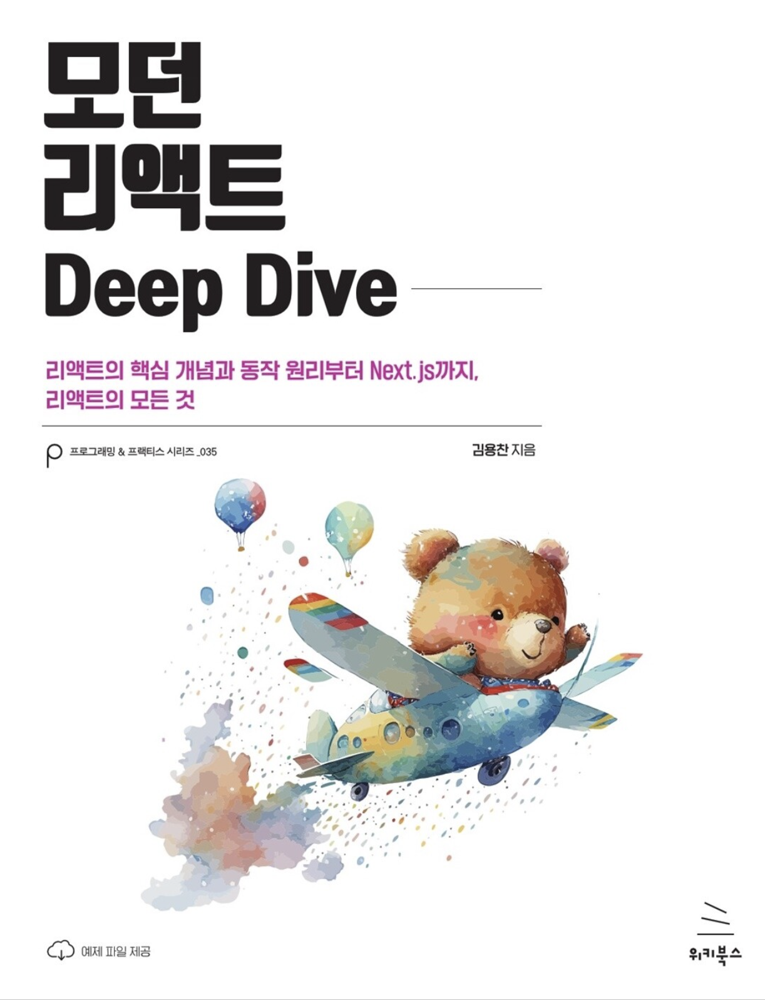

# ⭐️ Modern-React-Deep-Dive

<br/>
모던 리액트 Deep Dive Book Study 

<br />

## 📌 스터디 목표
- 공통 목표: 책 완주하기 절대 포기하지 않기🍋
- 황교진: 리액트 완.전.정.복🧗🏻‍♂️
- 남궁은선: 면접때 리액트 질문 대답 다 쳐내기⚔️

## 🕓 스터디 시간
일시 : 매주 토요일 am 9:30 ~ 11:00
<br/>
장소 : Discord 

## 💡 스터디 진행 순서
- 매주 범위 및 발표자 선정
- 매주 문서작성자 선정 
- **깃허브** 주차별 폴더에 발표자료 정리
    - 면접질문 or 발표내용 정리 
- 매주 토요일 아침 9:30로 시간 변경
- [이슈](https://github.com/KyoJin-Hwang/Modern-React-Deep-Dive/issues)에 매주 토론 내용 작성

## 📝 내용 정리
- 각 주차 자신의 폴더로 이동 
- 매주 공부한(읽었던) 내용을 선정된 목차 마크다운으로 정리
- 필요한 내용 위주로 팩트로 정리❗️ 
- 퀴즈는 내용 중간중간 넣기


## 🚀 스터디 방법
```javascript
0. 파일명의 띄어쓰기는 **_** 로 통일한다
1. 레파지토리를 `clone`해주세요.
2. `main` 브랜치에서 [아이디] 브랜치를 만들어주세요. ex) `Kyojin`
3. `[아이디]` 브랜치에서 본인의 주차 폴더에 정리한 내용을 push 해주세요.
    ex) `Week1/교진/1-1_자바스크립트의_동등비교.md`
4. `[아이디]` 브랜치에서 `main` 브랜치로 `PR(Pull Request)`를 보내주세요. 
    ex) `docs: 000 챕터 00내용 학습`
5. `PR`은 개인이 직접 `Merge`를 진행해주세요.
```

## 📌 주차별 학습 로드맵
| 주차  | 진행 | 스터디 날짜       | 챕터               | 참여자 |비고|
|-------|------|------------|--------------------|-------|---|
| [1주차](https://github.com/KyoJin-Hwang/Modern-React-Deep-Dive/tree/main/Week1) |   ✅  | 2025-07-19 | Chapter 1, 2       | ALL|❌|
| [1주차](https://github.com/KyoJin-Hwang/Modern-React-Deep-Dive/tree/main/Week2) |   ✅  | 2025-07-26 | Chapter 3, 4       | ALL|❌|


## 👤 스터디원


|||
|:-:|:-:|
|황교진<br/>[@Kyojin-Hwang](https://github.com/Kyojin-Hwang)|남궁은선<br/>[@Grapefruitgreentealoe](https://github.com/grapefruitgreentealoe)|

