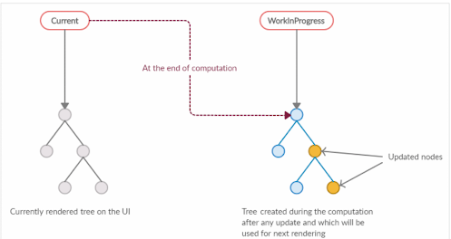

# 2.2 가상DOM과 리액트 파이버
리액트의 특징으로, 실제 DOM이 아니라 가상 DOM을 운영한다는 것이 있다. 
- 가상DOM이 왜 만들어졌는지
- 실제 DOM과는 어떤 차이가 있는지
- 정말로 실제 DOM을 조작하는 것보다 빠른지
- 가상 DOM을 다룰 때 주의할 점

에 대해 알아보자. 


## 2.2.1 DOM과 브라우저 렌더링 과정
브라우저가 웹사이트 접근 요청을 받고, 화면을 그리는 과정에서 일어나는 순서
1. 브라우저가 사용자가 요청한 주소를 방문해 HTML 파일을 다운로드 한다. 
2. 브라우저의 렌더링 엔진은 HTML을 파싱해 DOM 노드로 구성된 트리(DOM)을 만든다.
3. 2번 과정에서 CSS파일을 만나면 CSS 파일도 다운로드 한다. 
4. 브라우저의 렌더링 엔진은 이 CSS도 파싱해 CSS노드로 구성된 트리 CSSOM 을 만든다.
5. 브라우저는 2에서 만든 DOM을 순회하면서, 사용자 눈에 보이는 노드만 방문한다. (display:none과 같이 화면에 보이지 않는 요소는 방문하지 않는다. )
6. 5번에서 제외된 눈에 보이는 노드를 대상으로 해당 노드에 대한 CSSOM 정보를 찾아, 발견한 스타일정보를 노드에 적용한다. 
- 레이아웃 : 각 노드가 브라우저 화면의 어느 좌표에 위치해야하는지 계산하는 과정
- 페인팅 : 색과 같은실제 유효한 모습을 그리는 과정

> #### Quiz
> 1.컴포지팅 단계에 대해서 알고있나요?


## 2.2.2 가상 DOM의 탄생 배경
- SPA의 특징 덕분에 사용자는 페이지의 깜빡임 없이 자연스러운 웹페이지 탐색을 할 수 있지만 그만큼 DOM을 관리하는 과정에서 부담해야 할 비용이 커진다.
- 사용자의 인터렉션에 따라 DOM의 모든 변경사항을 추적하는 것은 어렵다.
- 가상 DOM은 웹페이지가 표시해야 할 DOM을 일단 메모리에 저장하고, 실제 변경 준비가 완료되었을 때 반영된다.
- 실제로 여러번 발생할 렌더링 과정을 최소화할 수 있어 브라우저와 개발자의 부담을 덜게 된다.
- 무조건 빠르진 않다. 대부분의 상황에서 웬만한 애플리케이션을 만들 수 있을 정도로 충분히 빠르다. 

> #### Quiz
> 가상 DOM의 방식은 DOM을 직접 조작하는 것보다 무조건 빠를까?

## 2.2.3 가상 DOM을 위한 아키텍처, 리액트 파이버
- 가상 DOM과 렌더링 과정 최적화를 가능하게 해주는 것이 리액트 파이버이다.

### 리액트 파이버란?
- 리액트에서 관리하는 자바스크립트 객체
- 파이버 재조정자가 관리하여, 변경이 필요한 파이버를 기준으로 화면에 렌더링을 요청한다.
- 하나의 작업 단위로 구성되어 리액트는 이 작업단위를 하나씩 처리하여 finishedWork라는 작업으로 마무리한다.
- 이 작업을 커밋하여 실제 브라우저 DOM에 가시적인 변경 사항을 만들어 낸다. 이러한 단계를 두 단계로 나눌 수 있다.
> 1. 렌더단계: 사용자에게 노출되지 않는 모든 비동기 작업을 수행.
>이 단계에서 파이버의 작업을 처리하고 우선순위를 지정하거나 중지하거나 버리는 등의 작업을 한다.
> 2. 커밋 단계에서는 실제 사항을 반영하기 위한 작업 commitWork()가 실행되는데, 이는 동기식으로 일어나 중단될 수 없다.
>


<br/>

>Quiz.
> - 파이버 구조 전,  과거에는 리액트는 OO 알고리즘으로 동기적으로 작업이 이루어져, 중단이 불가하였다.
어떤 알고리즘이였을까?
---
### 파이버의 리액트에서의 구현
- 파이버는 컴포넌트가 최초로 마운트 되는 시점에 생성되어 이후에는 가급적 재사용된다. 
- 아래 함수명에서 보듯, Fiber와 리액트 요소는 1:1 관계이다
    <details>
    <summary><code>createFiber</code></summary>

    ```js
    var createFiber = function(tag, pendingProps, key, mode) {
    return new FiberNode(tag, pendingProps, key, mode);
    };
    ```

    * `FiberNode` 인스턴스를 생성하는 팩토리 함수
    * `createFiberFromFragment` 등에서 사용됨

    </details>


    <details>
    <summary><code>createFiberFromElement</code></summary>

    ```js
    function createFiberFromElement(element, mode, lanes) {
    var owner = element._owner;

    var type = element.type;
    var key = element.key;
    var pendingProps = element.props;

    var fiber = createFiberFromTypeAndProps(
        type,
        key,
        pendingProps,
        owner,
        mode,
        lanes,
    );

    {
        fiber._debugSource = element._source;
        fiber._debugOwner = element._owner;
    }

    return fiber;
    }
    ````

    * React Element로부터 Fiber 생성
    * 내부적으로 `createFiberFromTypeAndProps` 호출

    </details>


    <details>
    <summary><code>createFiberFromFragment</code></summary>

    ```js
    function createFiberFromFragment(elements, mode, lanes, key) {
    var fiber = createFiber(Fragment, elements, key, mode);
    fiber.lanes = lanes;
    return fiber;
    }
    ```

    * Fragment 기반 Fiber 생성
    * `createFiber` 직접 호출

    </details>


- 주요 속성
> - tag : 1:1 매칭된 정보를 가지고 있는 것
> - stateNode : 파이버 자체에 대한 참조 정보. 이를 바탕으로 리액트는 파이버와 관련된 상태에 접근.
> - child,sibling,return : 파이버간의 관례 개념을 나타내는 속성.      
>     - 컴포넌트 트리와 다르게 children이 아닌 하나의 child만 존재
>     - 파이버의 자식은 항상 첫 번째 자식의 참조로 구성
> - index : 여러 형제들 사이 자신의 위치를 숫자로 표현
> - pendingProps: 아직 작업(렌더링에 사용)을 마저 처리하지 못한 props
> - memoizedProps: 렌더링이 완료된 이후 pendingProps를 memoizedProps로 관리
> - updateQueue: 상태 업데이트, 콜백 함수, DOM업데이트 등 필요한 작업을 담아두는 큐.
> - memoizedState: 함수 컴포넌트 훅 목록이 저장
> - alternate: 반대편 트리 파이버를 가리킴

- 작업을 직접 바로 처리하기도 하고, 스케줄링하기도 한다
- 변수에 UI관련 값을 보관하고, 리액트의 자바스크립트 코드 흐름에 따라 관리하고 표현하는 것이 리액트.
---
### 리액트 파이버 트리
- 더블 버퍼링: 
    - 파이버 트리는 현재 모습의 파이버트리와 작업중인 상태를 나타내는 WIP트리로 나뉘는데, 현재의 파이버 트리에서 에서 WIP 트리로 바꾸는 기술을 뜻한다.
    - 커밋 단계에서 수행된다.
    

#### 작업순서
1. 리액트는 beginWork()함수를 실행해, 더 이상 자식이 없는 파이버를 만날 때까지 트리 형식으로 시작된다.
2. 1번에서 작업이 끝난다면 completeWork()함수를 실행해 파이버 작업을 완료한다.
3. 형제가 있다면 형제로 넘어간다
4. 2,3번이 모두 끝났다면 return으로 돌아가 자신의 작업이 완료됐음을 알린다.
5. 루트 노드가 완성되는 순간, 최종적으로 commitWork()가 수행되고, 변경사항을 비교해 DOM에 반영된다

> Quiz. 스택 알고리즘에서는 render, commit 단계가 나눠져 있었을까요?
---

## 2.2.4 파이버와 가상 DOM
- 실제 브라우저 구조인 DOM에 직접 반영하는 것은 동기적으로 일어나야하고, 불완전한 형태로 표시될 수 있으므로 메모리상에서 먼저 수행하여 최종적 결과물만 DOM에 적용하게 됨.
- 가상 DOM과 리액트의 핵심은 빠르게 반영하는 게 아니라 값으로 UI를 표한하고, 흐름을 효율적으로 관리하는 것


