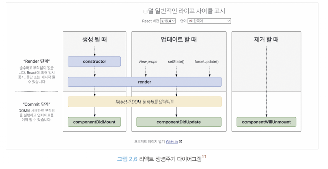

# 2.3 클래스 컴포넌트와 함수 컴포넌트

- 초기 (0.14버전) 에서의 함수 컴포넌트는 무상태 함수컴포넌트로 상태 없이 단순히 정적인 렌더링을 하는 것이 목적이었다. 
- 함수 컴포넌트는 16.8 버전에서 훅이 소개된 후 각광받았다. 


## 2.3.1 클래스 컴포넌트
- 클래스 컴포넌트를 만들 때는, 클래스를 선언하고 extends로 만들고 싶은 컴포넌트를 extends해야한다. 
- extends 구문에는 `React.Component`와 `React.PureComponent`를 넣을 수 있다. 
- Component에 제네릭으로 props,state를 순서대로 넣어준다.

    `class SampleComponent extends React.Component<SampleProps, SampleState>`

### 클래스 컴포넌트의 생명주기 메서드
생명주기 메서드가 실행되는 시점은 크게 3가지로 나눌 수 있다. 
>- 마운트(mount):컴포넌트가 마운팅(생성) 되는 시점
>- 업데이트(update): 이미 생성된 컴포넌트의 내용이 변경(업데이트) 되는 시점
>- 언마운트(unmount): 컴포넌트가 더 이상 존재하지 않는 시점
>
<br/>

다음으로 생명주기 메서드이다
#### render()
- 마운트와 업데이트 과정에서 실행
- 항상 순수해야하며 부수효과가 없어야한다. 즉 같은 입력값에 항상 같은 결과물을 반환해야한다. 

#### componentDidMount()
- 컴포넌트가 마운트 되고 준비되는 즉시 실행
- 이 메서드 내부에서 state를 변경하는 것이 가능하다.
- 브라우저가 실제로 ui를 업데이트 하기 전에 실행되어 사용자가 변경되는 것을 눈치채지 못함
- 성능 문제를 일으킬 수 있으므로 주의

#### componentDidUpdate()
- 컴포넌트 업데이트가 일어난 이후 바로 실행
- this.setState를 사용한다면 적절한 조건문으로 감싸야 계속 this.setState가 호출되는 것을 방지하고 성능상 문제를 방지

#### componentWillUnmount()
- 컴포넌트가 언마운트되거나 더 이상 사용되지 않기 직전에 호출
- 메모리 누수나 불필요한 작동을 막기 위한 클린업 함수를 호출하기 위한 최적의 위치



#### componentDidCatch()
- 자식 컴포넌트에서 에러가 발생했을 때 실행됨
- getDerivedStateFromError에서 에러를 잡고 state를 결정한 이후에 실행된다
- `error`, `info`(어떤 컴포넌트가 에러를 발생시켰는지에 대한 정보) 두 개의 인수를 받는다
- Error Boundary 클래스 구현
    <details>
    <summary><code>ErrorBoundary</code> 클래스 컴포넌트 전체 코드</summary>

    ```tsx
    import React, { ErrorInfo, PropsWithChildren } from "react";

    type Props = PropsWithChildren<{}>;
    type State = { hasError: boolean; errorMessage: string };

    export default class ErrorBoundary extends React.Component<Props, State> {
    constructor(props: Props) {
        super(props);
        this.state = {
        hasError: false,
        errorMessage: "",
        };
    }

    static getDerivedStateFromError(error: Error) {
        return {
        hasError: true,
        errorMessage: error.toString(),
        };
    }

    // componentDidCatch를 추가했다.
    componentDidCatch(error: Error, info: ErrorInfo) {
        console.log(error);
        console.log(info);
    }

    render() {
        // 에러가 발생했을 경우에 렌더링할 JSX
        if (this.state.hasError) {
        return (
            <div>
            <h1>에러가 발생했습니다.</h1>
            <p>{this.state.errorMessage}</p>
            </div>
        );
        }

        // 일반적인 상황의 JSX
        return this.props.children;
    }
    }
    </details> 
    

- 리액트에서 에러 발생 시 이 메서드에서 제공되는 에러 정보를 바탕으로 로깅할 수 있다.
- 에러가 발생한 컴포넌트 트리 영역만 별도로 처리하여 애플리케이션 전체에 에러가 전파되어 표시되는 것을 방지할 수 있다.


> Error Boundary 에서 주의할 점
>
> componentDidCatch는 개발모드와 프로덕션 모드에서 다르게 작동한다. 
> 개발모드에서는 에러가 발생하면 window까지 전파된다.
> 프로덕션에서는 잡히지 않은 에러만 window까지 전파된다.

### 클래스 컴포넌트의 한계
- 데이터 흐름을 추적하기 어렵다: 여러 메서드에서 state의 업데이트가 일어나고, 코드 작성시 메서드의 순서가 강제되어 있지 않아서 읽기 어렵다
- 애플리케이션 내부 로직의 재사용이 어렵다: 코차 컴포넌트로 감싸는 방법이 있는데, 래퍼 지옥으로 갈 수 있다.
- 기능이 많아질 수록 컴포넌트의 크기가 커진다.
- 클래스는 함수에 비해 상대적으로 어렵다
- 코드 크리를 최적화하기 어렵다
- 핫 리로딩이 상대적으로 불리하다: 핫리로딩 시 마다 인스턴스가 새로 만들어져야한다.

이러한 한계를 극복하기 위해, 기존의 무상태 함수 컴포넌트에 상태를 더할 수 있는 훅을 출시한다

## 2.3.3 함수 컴포넌트 vs 클래스 컴포넌트
### 생명주기의 부재
- 함수컴포넌트에는 생명주기 메서드가 존재하지 않다. 
    - useEffect로 componentDidMount, componentDidUpdate, componentWillMount를 비슷하게 구현할 수 있다.
    - 하지만 useEffect는 생명주기를 위한 훅은 아니고 state를 활용하여 동기적으로 부수효과를 만드는 매커니즘이라는 점 기억하자

### 함수 컴포넌트와 렌더링 된 값
- 함수 컴포넌트는 렌더링된 값을 고정하고, 클래스 컴포넌트는 못한다. 
- 3초의 setTimeout을 두고, props가 중간에 변경되었을 때, 함수컴포넌트는 클릭한 시점의 props를, 클래스 컴포넌트은 3초 뒤 변경된 props를 사용한다. 


