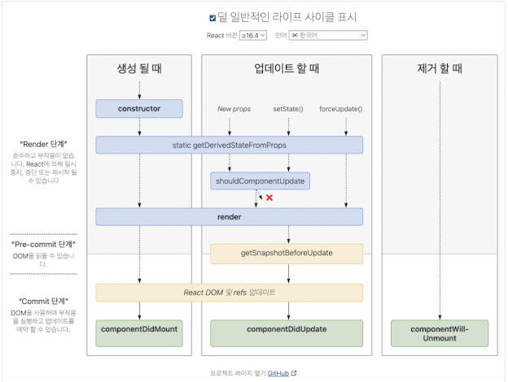
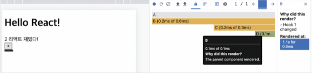
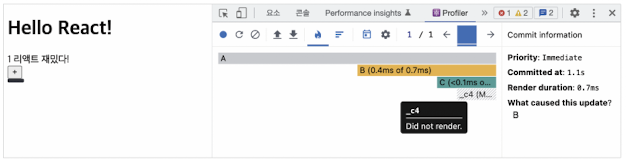

# 2.4 렌더링은 어떻게 일어나는가

## 2.4.1 리액트의 렌더링이란? 
- 브라우저에서의 렌더링: 

    웹 페이지의 HTML, CSS, JavaScript 코드를 해석하여 시각적으로 화면에 표시하는 과정
- 리액트에서의 렌더링: 
    
    리액트 애플리케이션 트리 안에 있는 모든 컴포넌트들이 현재 자신들이 가지고 있는 props와 state의 값을 기반으로 어떻게 UI를 구성하고 이를 바탕으로 어떤 DOM 결과를 브라우저에 제공할 것인지 계산하는 일련의 과정


## 2.4.2 리액트의 렌더링이 일어나는 이유
1. 최초 렌더링: 사용자가 처음 애플리케이션에 진입할 때 수행하는 최초 렌더링
2. 리렌더링: 리렌더링은 처음 애플리케이션에 진입했을 때 최초 렌더링이 발생한 이후로 발생하는 모든 렌더링.
    - 발생하는 경우(함수 컴포넌트 기준)
        - useState의 setter 실행
        - useRedcer의 dispatch 실행
        - 컴포넌트의 key props가 변경되는 경우
        - props가 변경
        - 부모 컴포넌트가 렌더링 될 때

> 리액트에서의 key란?
>
> 리액트에서 key는 리렌더링이 발생하는 동안 형제 요소들 사이에서 동일한 요소를 식별하는 값
> 렌더링이 발생하면 current 트리와 workInProgress 트리 사이에서 어떠한 컴포넌트가 변경이 있었는지 구별해야 하는데, 이 두 트리 사이에서 같은 컴포넌트인지를 구별하는 값
> key가 없다면 단순히 파이버 내부의 sibling 인덱스만을 기준으로 판단하게 된다
> key를 활용해 강제로 리렌더링을 일으키는 것이 가능

> Q. redux는 왜 recoil과 다르게 별도의 리액트 패키지가 필요할까?
>
> redux는 직접적으로 상태 관리를 통해 리렌더링을 시키지 못한다. 위의 리렌더링을 일으키는 방법 중 하나를 사용한다.
> 반면 recoil은 내부에서 useState를 직접 실행하여 리렌더링을 발생시킨다.

## 2.4.3 리액트의 렌더링 프로세스
### 렌더
1.  렌더링 프로세스가 시작되면 리액트는 컴포넌트의 루트에서부터 차근차근 아래쪽으로 내려가면서 업데이트가 필요하다고 지정돼 있는 모든 컴포넌트를 찾는다 (type,props,key의 변화 감지)
2. 업데이트가 필요하다고 지정돼 있는 컴포넌트를 발견하면 클래스 컴포넌트의 경우에는 클래스 내부의 render() 함수를 실행하게 되고, 함수 컴포넌트의 경우에는 FunctionComponent() 그 자체를 호출한 뒤에, 그 결과물을 저장
3. 렌더링 결과물은 JSX 문법에서 자바스크립트로 컴파일되면서 React.createElement()를 호출하는 구문으로 변환
4. createElement는 브라우저의 UI 구조를 설명할 수 있는 일반적인 자바스크립트 객체를 반환

    <details>
    <summary>JSX → React.createElement 변환 예시</summary>

    ```jsx
    // JSX 문법
    function Hello() {
    return (
        <TestComponent a={35} b="yceffort">
        안녕하세요
        </TestComponent>
    );
    }
    ````

    JSX는 다음과 같이 변환됨:

    ```js
    function Hello() {
    return React.createElement(
        TestComponent,
        { a: 35, b: 'yceffort' },
        '안녕하세요'
    );
    }
    ```

    변환된 결과 객체:

    ```js
    {
    type: TestComponent,
    props: {
        a: 35,
        b: 'yceffort',
        children: '안녕하세요'
    }
    }
    ```

    </details>

5. 리액트의 새로운 트리인 가상 DOM과 비교해 실제 DOM에 반영하기 위한 모든 변경 사항을 수집 (재조정)
### 커밋
 모든 변경 사항을 하나의 동기 시퀀스로 DOM에 적용해 변경된 결과물이 보이게 된다.

### 2.4.4 렌더링은 렌더와 커밋으로 나뉜다

- 렌더 단계(Render Phase) : 
    - 컴포넌트를 렌더링하고 변경 사항을 계산하는 모든 작업.
    - type, props, key 이 세 가지 중 하나라도 변경된 것이 있으면 변경이 필요한 컴포넌트로 체크해 둔다.

- 커밋 단계(Commit Phase) : 
    - 렌더 단계의 변경 사항을 실제 DOM에 적용해 사용자에게 보여주는 과정
    - 이 단계가 끝나야 비로소 브라우저의 렌더링이 발생

> Q. 리액트의 렌더링이 일어난다고 해서 무조건 DOM 업데이트가 일어나는 것은 아니다?



### 2.4.5 일반적인 렌더링 시나리오 살펴보기
1. memo 추가 전

2. memo 추가 후

memo로 선언한 덕분에 props가 변경되지 않으면 렌더링이 생략되므로 커밋 단계도 생략되었다.

