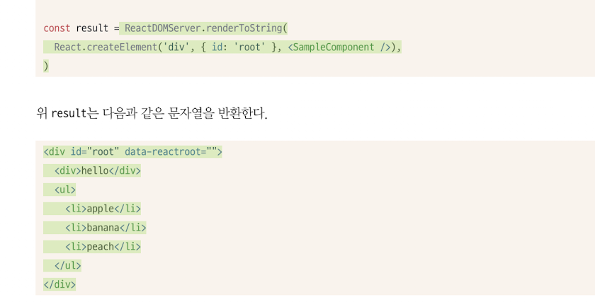
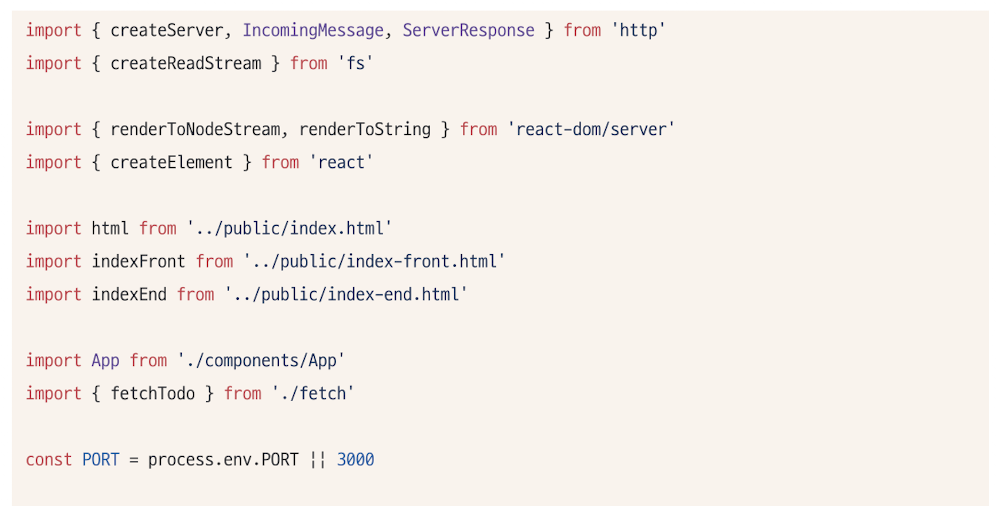
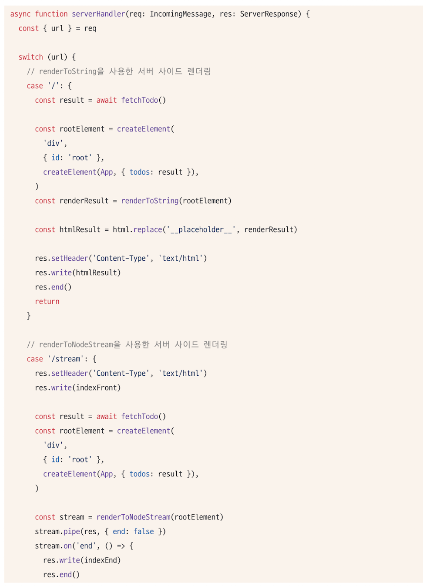
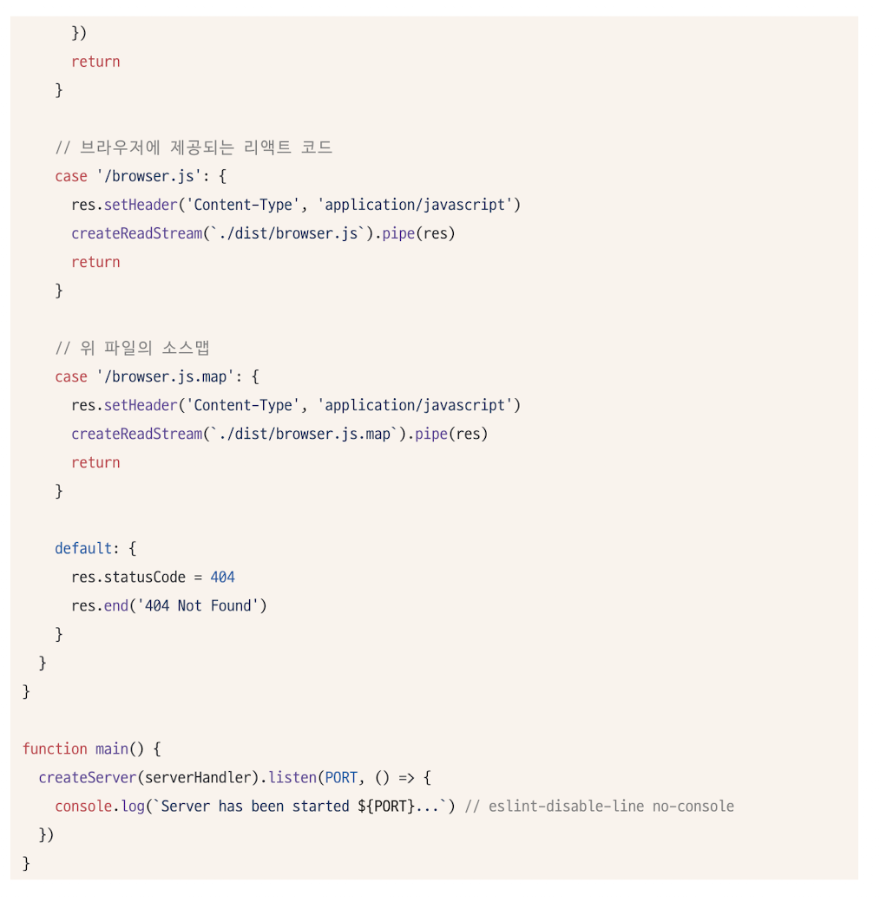

# 4.2 서버 사이드 렌더링을 위한 리액트 API 살펴보기
- 서버사이드 렌더링을 위한 리액트 API는 react-dom/server.js를 확인하면 된다. 
- 여기에는 react-dom이 서버에서 렌더링하기 위한 다양한 메서드를 제공한다. 
- server.node.js에 있는 함수를 export하고 있고, 어떤 역할을 하는지 살펴보자. 
- 리액트 18이 릴리즈 되면서 react-dom/server에 renderToPipableStream이 추가되었고, 나머지는 대부분 지원 중단되는 등 큰 변화가 생겼다. 

> Q. 리액트 18 전후에 서버사이드 관련 어떤 변화가 있었을까?
>
> Q. 리액트 19에는 서버사이드 관련 어떤 변화가 있었을까?
> 


##  renderToString
- 인수로 넘겨받은 리액트 컴포넌트를 렌더링해 HTML 문자열로 반환하는 함수
- 최초의 페이지를 HTML로 먼저 렌더링하는 함수



- useEffect와 같은 훅과 handleClick과 같은 이벤트 핸들러는 결과물에 포함되지 않았다. 
- 인수로 주어진 리액트 컴포넌트를 기준으로 빠르게 브라우저가 렌더링할 수 있는 HTML을 제공하는 데에 목적이 있기 때문
- 클라이언트에서 필요한 자바스크립트는 생성된 HTML과 별도로 브라우저에 제공되어 다운로드, 파싱, 실행하는 과정을 거쳐야한다. 
- div#root에 존재하는 속성 `data-reactroot`: 리액트 컴포넌트의 루트 엘리먼트가 무엇인지 식별하고, 자바스크립트를 실행하기 위한 hydrate 함수에서 루트를 식별하는 기준점이 된다. 

## 4.2.2  renderToStaticMarkup
- renderToString과 매우 유사한 함수
- 두 함수 모두 리액트 컴포넌트를 기준으로 HTML문자열을 만든다는 점에서 동일.
- 차이 :renderToStaticMarkup은 앞서 루트 요소에 추가한 data-reactroot와 같은 리액트에서만 사용하는 추가적인 DOM 속성을 만들지 않는다는 점. 
- hydrate를 수행하지 않는다는 가정하에 순수한 HTML만 반환
- 결과적으로 hydrate를 수행하도 클라이언트에서 완전히 새롭게 렌더링하게 된다. 
- 아무런 브라우저 액션이 없는 정적인 내용만 필요한 경우 유용. 

## 4.2.3 renderToNodeStream
- renderToString과 차이점
    - renderToString과 renderToStaticMarkup과 다르게 브라우저에서 실행할 수 없다. 
    - 결과물의 타입이 ReadableStream이다. 즉 서버환경에서만 사용할 수 있다. 따라서 string으로 변환하는 데에 추가적인 처리가 필요하다.
- 대신 큰 크기의 데이터를 청크 단위로 분리해 순차적으로 처리할 수 있는 장점이 있다. 

## 4.2.4 renderToStaticNodeStream
- renderToNodeStream과 제공하는 결과물은 동일하나, renderToStaticMarkup과 마찬가지로, hydrate할 필요없는 순수 HTML결과물이 필요할 때 사용하는 메서드

## 4.2.5 hydrate
- HTML 콘텐츠에 자바스크립트 핸들러나 이벤트를 붙이는 역할을 한다. 
- 브라우저에서만 사용되는 메서드인 render또한, 클라이언트에서만 실행되는 렌더링과 이벤트 핸들러 추가 등을 수행. 
- render와의 차이점은 hydrate는 기본적으로 이미 렌더링된 HTML이 있다는 가정하에 작업이 수행된다.


> Q. hydrate 함수는 모든 종류의 HTML콘텐츠에 자바스크립트 핸들러나 이벤트를 붙일 수 있을까요?
>
> A. 아니다. 
>이미 렌더링 된 상태에서만 hydrate가 실행된다. 
>왜냐하면, hydrate는 HTML이 이미 화면에 렌더링 되어있어야 실행이 되기 때문이다. 
>아무것도 없는 빈 HTML에 이 정보를 렌더링하는 render와의 차이가 이것이다. 

- 서버에서 렌더링한 정보가 없어서 경고가 노출되었으메도, 리액트는 이 함수를 통해 정상적으로 웹페이지를 만든다. 
- hydrate작업이 단순 이벤트나 핸들러를 추가하는 것 외에도, 렌더링을 한번 더 수행하면서 hydrate가 수행한 렌더링 결과물의 HTML과 인수로 넘겨받은 HTML을 비교하는 작업을 수행하면서 이런 에러를 잡는다 (hydrate 전 후의 HTML을 비교)
- 이 때 불일치가 발생하면 hydrate를 한 이후의 것을 기준으로 화면에 그린다. 
- 이렇게 렌더링을 하면, 사실 상 서버와 클라이언트에서 두 번 렌더링을 하게 되고, 결국 서버사이드 렌더링의 장점을 포기하는 것이기 때문에, 반드시 고쳐야 하는 문제이다. 

- 불가피하게 불일치가 발생할 수 있는 곳에는 suppressHydrationWarning을 추가해 경고를 끌 수 있다. 
- 시간함수 등을 사용할 때는 useEffect를 통해 실행하는 것이 나을 수 있다. 

```xml
<div suppressHydrationWarning>{new Date.getTime()}</div>
```

## 4.2.6 서버사이드 렌더링 예제 프로젝트
- 리액트 팀은 리액트 서버사이드 렌더링을 직접 구현하는 것보다 Nextjs 와 같은 프레임워크를 사용하는 것을 권장 하고 있다. 

#### index.tsx
index.tsx파일은 create-react-app의 index.jsx와 유사한 역할의 시작점
hydrate가 포함되어있다. 

서버에서 완성한 HTML과 하이드레이션 대상이 되는 HTML의 결과물이 동일한지 비교한느 작업을 거치므로, 이 비교 작업을 무사히 수행하기 위해 한번 더 데이터를 조회한다. 

> Q. 두번 호출하면 손해일텐데, 이를 어떻게 극복해야하나요?
>
> A. 두번 호출하게 되면, 네트워크 낭비가 생기게 된다. 
>그렇기 때문에 한번만 호출하면서도, 비교가 가능해지도록 작성한다.
>
>```js
>// getServerSideProps로 서버에서 데이터 조회
>export async function getServerSideProps() {
>  const data = await fetchSomeData();
>  return { props: { data } }; // 👉 이게 HTML과 함께 클라이언트로 전달됨
>}
>
>// 페이지 컴포넌트에서 props로 받음
>export default function Page({ data }) {
>  return <App data={data} />;
>}
>
>```


### index.html
이 HTML 파일은 서버사이드 렌더링을 수행할 때 기본이 되는 HTML 템플릿이다. 
- \_\_placeholder\_\_ 는 서버에서 리액트 컴포넌트를 기반으로 만든 HTML 코드를 삽입하는 자리이다. 
-  browser.js는 클라이언트 리액트 애플리케이션 코드를 번들링 했을 때 제공되는 리액트 자바스크립트 코드이다. 

### server.ts
- 사용자의 요청 주소에 따라 어떠한 리소스를 내려줄 지 결정하는 역할
- 특히 SSR을 위해 이 파일에서 리액트 트리를 만드는 역할도 담당. 




#### createServer
http모듈을 이용해 간단한 서버를 만들 수 있는 Node.js기본라이브러리.
3000번 포드를 이용하는 HTTP서버를 만들었다고 이해하면 쉽다. 

#### serverHandler
- createServer로 넘겨주는 인수. HTTP 서버가 라우트(주소)별로 어떻게 작동할지를 정의하는 함수.

#### server.ts의 루트("/") 라우터
- renderToString을 활용해 리액트 컴포넌트를 HTML로 만들고, \_\_placehodler\_\_ 를 대상으로 replace를 실행하고, 서버응답으로 제공. 
그 결과 브라우저에서 결과를 확인.

#### server.ts의 /stream라우터
- renderNodeStream로 청크 단위로 HTML을 생성한다. 
- 청크가 생성될 때 마다 res에 기록
- 한 스트림이 종료되면, 나머지를 붙이고, 최종 결과물을 브라우저에 제공. 
- '/' 방식과 동일하지만 페이지를 만드는 순서대로 제공하기 때문에 더욱효율적이다. 


>Q. 스트리밍 방식이 효율적인 이유
> 
>점진적 로딩 (Progressive Loading): 전통적인 SSR 방식은 서버에서 모든 HTML을 렌더링할 때까지 기다렸다가 한 번에 전송합니다. 이와 달리 스트리밍 방식은 서버가 HTML을 생성하는 즉시 브라우저로 전송합니다. 즉, <head> 태그, 초기 UI 요소 등 먼저 준비되는 부분을 먼저 보내고, 이어서 나머지 컴포넌트들의 HTML을 순차적으로 스트리밍합니다.
>
>빠른 첫 콘텐츠풀 페인트 (FCP): 사용자는 웹페이지에 접속했을 때 빈 화면을 오래 보는 것을 싫어합니다. 스트리밍 방식은 페이지의 일부라도 먼저 브라우저에 도달하면 즉시 렌더링을 시작할 수 있으므로, 사용자가 콘텐츠를 더 빨리 볼 수 있게 됩니다. 이는 웹사이트의 사용자 경험(UX)을 크게 향상시킵니다.
>
>서버 자원 효율성: 서버는 전체 페이지가 완성될 때까지 모든 데이터를 메모리에 유지할 필요 없이, 렌더링이 완료되는 부분을 즉시 전송하고 해당 자원을 해제할 수 있습니다. 이는 특히 트래픽이 많거나 복잡한 페이지를 처리할 때 서버의 메모리 사용량과 응답 시간을 줄이는 데 도움이 됩니다.

#### 그 밖의 라우터
- browser.js : 애플리케이션에서 작성한 리액트 및 관련 코드 제공. 웹팩이 생성
- browser.js.map : browser.js와 관련된 소스맵파일. 디버깅용

### webpack.config.js
- configs배열은 각각 브라우저 코드와 서버 코드를 번들링 하는 방식을 선언해 뒀다. 

## 4.2.7 정리
- 사용자에게 더 빠른 웹페이지 결과물을 제공할 수 있다는 장점 이면엔 서버가 있다. 
- 이 서버라는 존재 자체가 개발자에게 더욱 부담이 된다.
- 서버에서 HTML 을 제공하는 것 뿐만 아니라 번들링된 자바스크립트 소스도 제공해야하고, 적절하게 캐시도 사용해야 하는 등 고려해야함. 
- 리액트 18에서는 suspense나 concurrent, 그리고 서버사이드 렌더링과는 약간 다른 ServerComponent 등의 개념이 추가되면서 서버에서 렌더링 하는 것이 더욱 복잡해졌다. 
