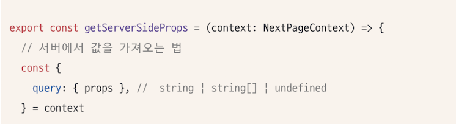
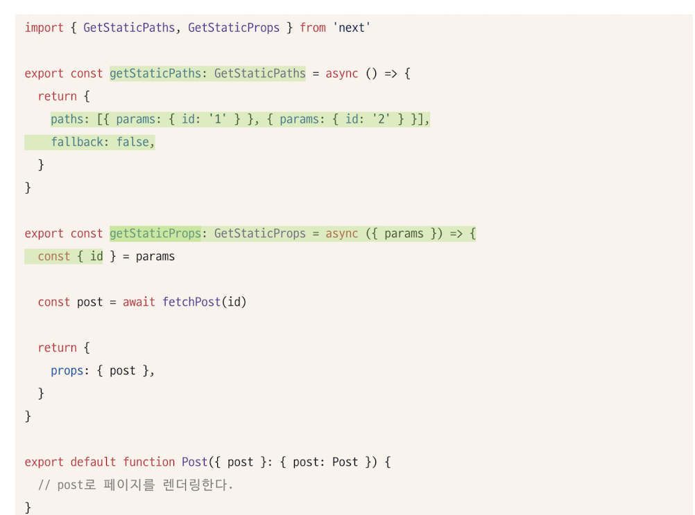
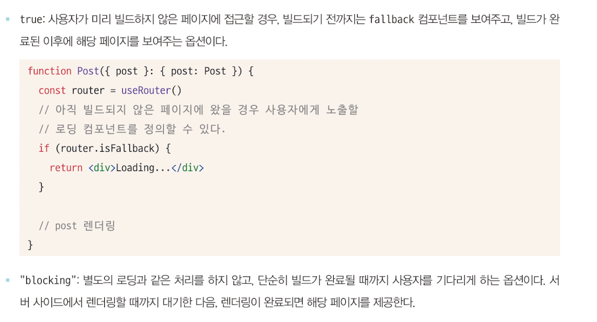
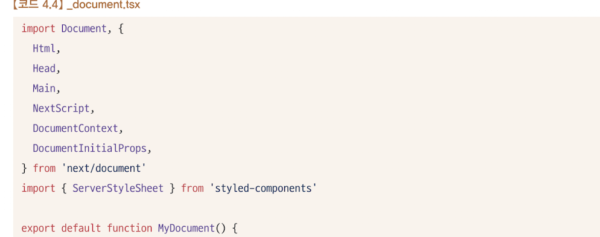
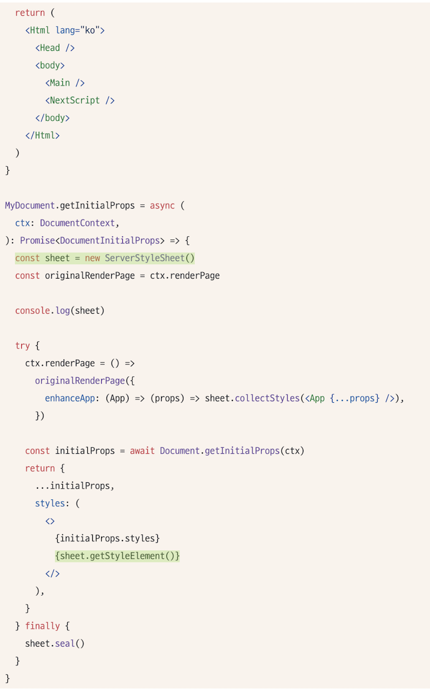
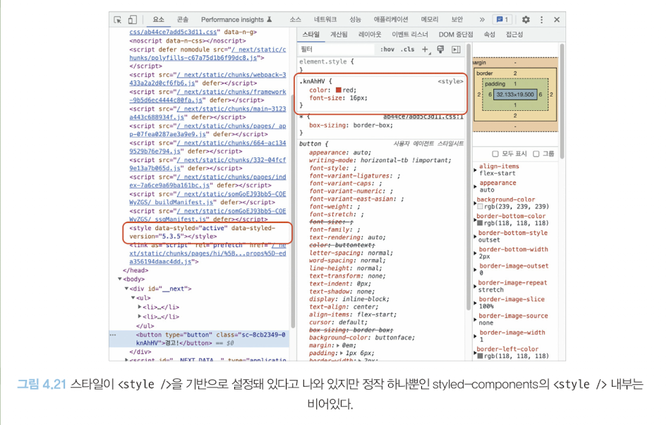
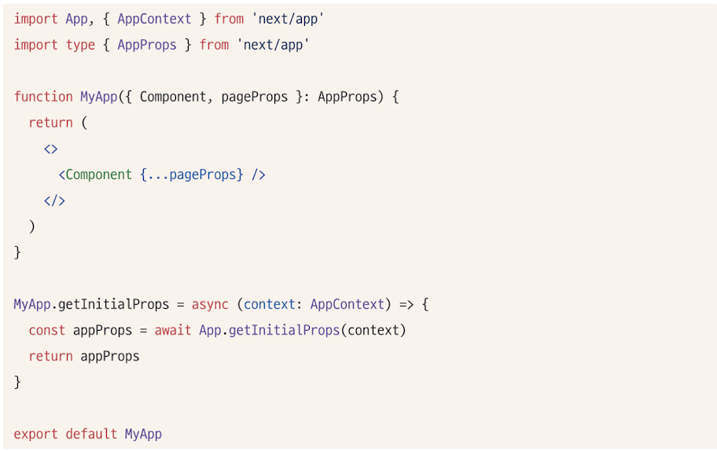
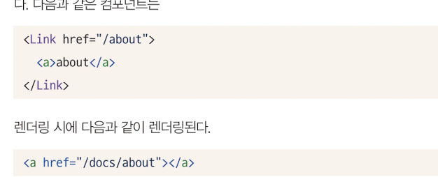

# Next.js 톺아보기
- 어떠한  API가 있고, 어떻게 리액트를 기반으로 작동하는 지 알아보자. 

## 4.3.1 Next.js란
- PHP에 영감을 받아 만들어졌다. 
- 최초 설계 당시부터 SSR 을 염두에 뒀던 것으로 보인다. 

## 4.3.2 Next.js 시작하기
### package.json

### next.config.js
- reactStrictMode
- swcMinify : 
    - 바벨의 대안으로 볼 수 있다. 
    - 바벨과는 다르게 Rust로 작성됨 .
    - 병렬로 작업 처리
    - 이런 SWC를 기반으로 코드 최소화 작업을 할 것인지에 대한 여부
    - 특별한 이유가 없다면 SWC를 쓰느 것을 권장. 

### pages/_app.tsx
- 웹 애플리케이션에서 공통으로 설정해야 하는 것들을 여기에서 실행. 
- 에러바운더리를 사용해 에러처리
- reset.css 같은 전역 css 선언 
- 모든 페이지에 공통으로 사용 또는 제공해야하는 데이터 제공
- _app.tsx의 render()는 최초에는 서버사이드에서, 이후에는 클라이언트에서 실행된다. 

### pages/_document.tsx
- _app.tsx가 애플리케이션 페이지 전체를 초기화한다면, 이곳은 애플리케이션의 HTML을 초기화하는 곳이다. 
- DOM속성을 직접 추가할 때 사용
- 무조건 서버에서만 실행되기 때문에, 이벤트 핸들러 등 스크립트 추가 불가 
- Next.js에서 두가지 head가 존재한다. 
    - next/document에서 제공하는 head : 오직 _document.tsx에서만 사용 가능. title을 사용할 수 없다. 
    - next/head에서 기본적으로 제공하는 head : 페이지에서 사용할 수 있고 seo에 필요한 정보나 title등을 담을 수 있다. 
- Next.js로 만드는 웹사이트의 뼈대가 되는 HTML관련된 코드를 추가하는 곳. 반드시 서버에서만 렌더링된다. 

### pages/_error.tsx
- 클라이언트에서 발생하는 에러 또는 서버에서 발생하는 500에러를 처리할 목적으로 만들어졌다. 
- 전역에서 발생하는 에러를 적절하게 처리할 때 사용
- 개발 모드에서는 방문할 수 없어서, 빌드해서 확인 가능. 

### pages/404.tsx
- 404 페이지

### pages/500.tsx
- 500에러가 날때. _error.tsx보다 우선적으로 실행된다. 

### pages/[그 외에].tsx

- index.tsx: 웹사이트의 루트.
- /pages/a/[variable].tsx : variable이라는 변수에 사용자가 접속한 주소명이 오게 된다. 그리고 이 variable을 접근이 가능하다. []안의 내용은 변수로 처리된다. 
- /pages/a/[...props].tsx : /a를 제외한 하위 모든 주소가 여기로 온다. 

getServersideProps의 context의 query.props 를 통해 접근이 가능하다. 

#### 서버 라우팅과 클라이언트 라우팅의 차이 
- SSR의 최초 페이지 렌더링은 서버에서 수행된다. 
- next/link는 라우팅 컴포넌트이고 <a/\> 와 비슷한 동작을 한다.
- a 태그로 이동할 때는 모든 리소스를 처음부터 다시 받는다.
- 하지만 next/link를 통해 들어갔을 때는 새로운 페이지 이동에 필요한 내용만 받는다
- 이러한 클라이언트 라우팅의 장점을 활용하기 위해, Link를 사용하고, window.location.push 대신, router.push를 사용하자. 

#### 페이지에서 getServerSideProps를 제거하면 어떻게 될까?
- 있는 채로 빌드하면, 서버사이드 런타임 체크가 되어있다. 
- 없는 채로 빌드하면, 서버사이드 렌더링이 필요없는 정적인 페이지로 분류된다. 
- typeof window의 처리를 모두 object로 바꾼 다음, 빌드 시점에 미리 트리쉐이킹을 해버린다. 

### /pages/api/a.ts
- /api/a 로 호출이 가능하여 HTML요청을 하는 게 아니라 단순히 서버 요청을 주고받게 된다. 
- 서버에서 내려주는 데이터를 조합해 BFF형태로 활용하거나
- 완전한 풀스택 애플리케이션을 구축하고 싶을 때 
- CORS 문제를 우회하고 싶을 때 사용될 수 있다. 

## 4.3.3 Data Fetching
- pages/폴더에 있는 라우팅이 되는 파일에서만 사용할 수 있다. 
- 예약어로 지정되어 반드시 정해진 함수명을 export를 사용해 함수를 파일 외부로 내보내야한다. 

### getStaticPath와 getStaticProps
- 두 함수는 어떠한 페이지를 CMS나 블로그, 게시판과 같이 사용자와 관계없이 정적으로 결정된 페이지를 보여주고자 할 때 사용되는 함수이다. 
- 두 함수는 반드시 함께 있어야 사용할 수 있다. 

- getStaticPath는 접근 가능한 주소를 정의
- getStaticProps를 해당 페이지로 요청이 왔을 때 제공할 props를 반환하는 함수. 
- 이렇게 사용자가 접근할 수 있는 페이지를 모조리 빌드하고 배포하면 페이지가 렌더링하는 것을 기다릴 필요 없다. 
- getStaticPaths 함수의 반환값 중 fallback 옵션은, 미리 빌드해야할 페이지가 많은 경우 사용
- path에 미리 빌드해 둘 몇개의 페이지만 리스트로 반환하고, true나 'blocking'으로 값을 선언할 수 있다. 
- 미리 반환해 둔 paths에 기재도 있는 페이지만 미리 빌드하고 나머지 페이지의 경우는 다음과 같이 작동

### getServerSideProps
- 서버에서 실행되며 해당 함수가 있으면 무조건 페이지 진입 전에 이 함수를 실행. 
- 응답값에 따라 페이지의 루트 컴포넌트에 props를 반환할 수도, 다른 페이지로 리타이렉트시킬 수도 있다. 
- context.query.id로 경로의 id값에 접근이 가능하다. 
- 해당 페이지 접근 시 결과물에 "__NEXT_DATA__" 라는 id가 지정된 script가 있다. 
    - 이 스크립트는 getServerSideProps의 정보인 props뿐 아니라 현재 페이지 정보, query 등 다양한 정보가 있다. 
    - script형태로 삽입되어 있는 이유는, fetch시점에 따라 결과물의 불일치가 발생할 수 있으므로 서버에서 가져온 정보를 HTML에 script형태로 내려주는 것이다. 
    - Next.js에서는 이 정보를 window객체에도 저장해 둔다. 
>> Q.__NEXT_DATA__안에 class나 Date를 담을 수 있나요? 
>   A.아니다. 
>    - 이 정보는 직렬화가 가능한 정보만 담을 수 있다. 즉 class나 Date 등은 제공 불가. 
>    - "Reason: object ("[object Date]") cannot be serialized as JSON. Please only return JSON serializable data types.라는 에러가 발생한다.
     - 서버에서만 실행된다. 
     - API호출 시, protocal과 domain없이 fetch요청이 불가하다. 브라우저와 달리 서버는 자신의 호스트를 유추할 수 없기 때문이다.
     - 여기서 에러가 발생하면 에러페이지로 리다이렉트된다. 
- 컴포넌트 내 이벤트 핸들러함수와 useEffect와 같은 경우를 제외하고 서버에서 실행될 수 있기 때문에, 클라이언트에서만 실행 가능한 부분은 별도 처리해야한다. 
- 이 함수는 사용자가 매 페이지를 호출할 때마다 실행되고, 끝나기 전까지는 사용자에게 아무것도 못보여준다. 따라서 간결하게 작성해야한다. 
-  최초에 보여줘야할 데이터가 아니라면 클라이언트에서 호출하는 것이 유리하다. 
- 조건 별 리다이렉트가 가능하다. 

### getInitialProps
- getServerSideProps와 달리 props객체를 반환하는 것이 아니라 바로 객체를 반환한다. 
- 라우팅에 따라서 서버와 클라이언트 모두에서 실행이 가능하다. 

## 4.3.4 스타일 적용하기. 

### 전역 스타일
- 스타일을 초기화 하는 등 애플리케이션 전체에 공통으로 적용하고 싶은 스타일이 있다면 _app.tsx를 활용. 

### 컴포넌트 레벨 CSS
- module.css등을 활용하여 클래스명 충돌 방지. 

### CSS-in-JS
- styled-component의 스타일을 Next.js에 추가하려면 이런 코드 필요함. 

- 각 styled-components스타일을 모두 모은다음, 각각 스타일에 유니크한 클래스명을 부여해 스타일이 충돌하지 않게 정리하고, _document.tsx가 서버에서 렌더링할 때 React.Context  형태로 제공하게 된다. 
- 이렇게 서버에서 미리 모은 다음 SSR에서 한꺼번에 제공하는 과정을 거치지 않는다면, 브라우저에서 뒤늦게 추가되어 FOUC(flash of unstyled content)가 발생. 
- 바벨대신 swc사용하면 next.config.js에 compiler.styledComponents 옵션 추가

### 프로덕션에서는 style 태그 내부가 비어있는데 스타일은 정상적으로 적용이 되어있다. 
- styled-componets가 개발모드와는 다르게, SPEEDY_MODE라는 설정ㅇ르 사용
- 이 설정이 켜져있으면 HTML에 스타일을 적용하는 대신, 자바스크립트를 활용하여 CSSOM트리에 직접 스타일을 넣는다. 이는 기존 스타일링 방식보다 훨씬 빠르다. 

- styled-jsx, styled-components, emotion은 별도의 바벨 설정없이 swc와 함께 사용 가능하므로, 빠른 빌드의 이점을 누릴 수 있다. 

## 4.3.5 _app.tsx 응용하기
 
- 이 코드는 다른 페이지의 getinitialProps를 실행해서 반환한다. 
- <Link/> 나 router를 이용하면 이후 라우팅은 클라이언트 렌더링처럼 작동한다고 하였다. 
- 이 때 getServerSideProps와 같은 서버관련 로직이 있다고 하더라도, 전체 페이지를 가져오는 것이 아닌, 해당 페이지의 getServerSideProps 결과를 json 파일만을 요청해서 가져온다. 
- 이러한 특성을 이용해, 최초에 접근했을 때만 실행하고 싶은 내용을 app.getInitialProps 내부에 담아둘 수 있다. 

## 4.3.6 next.config.js
- basePath : 서비스의 시작 경로. 클라이언트 렌더링을 트리거하는 모든 주소에 알아서 basePath가 붙은 채로 렌더링 및 작동하게 된다. 

- swcMinify : swc 로 코드를 압축할지에 대한 여부. next.js13부터 기본값이 true이다. 
- poweredByHeader: Next.js는 응답헤더에 X-Power-by :Next.js정보를 제공하는데, 이는 보안적으로 취약점으로 분류하는 헤더이므로 , false를 설정하여 없앨 수 있다. 
- redirects: 특정 주소를 다른 주소로 보내고 싶을 때 사용. 
- reactStrictMode
- assetPrefix :  빌드된 일부 결과물을 다른 CDN에 등에 업로드 하고자 한다면
이 옵션에 해당 CDN주소를 명시하면 된다. 
    static 리소스들은 해당 주소에 있다고 가정하고 해당 주소로 요청하게 된다. 

