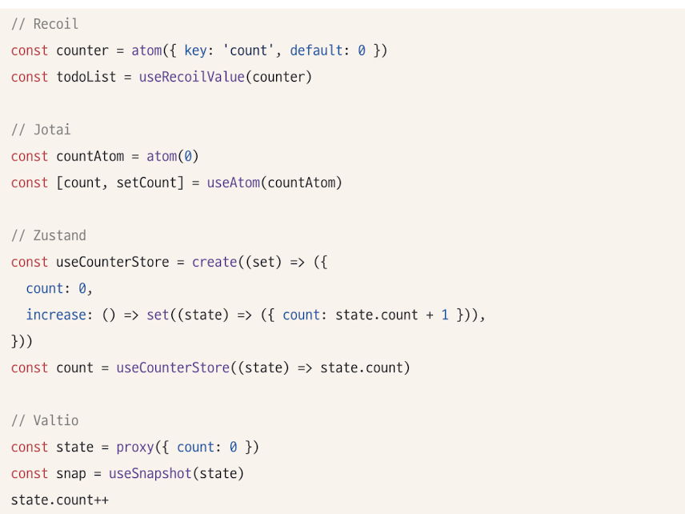

# 5.1 상태 관리는 왜 필요한가

- 상태: 지속적으로 변할 수 있는 값
- 상태로 분류될 수 있는 것들의 예시
  - UI : 인터렉션 가능한 모든 요소의 현재 값
  - URL: queryPath나 queryString
  - form: loading,submit,disabled,validation 등
  - 서버상태: 서버로부터 요청한 값

단순히 상태를 관리한다는 것은 크게 어려운 일은 아니지만,
애플리케이션 전체적으로 관리해야할 상태에 대해서는 문제가 존재한다.

- 상태를 어디에 둬야하는지(전역, 지역)
- 별도의 클로저를 만들 것인지. 그렇다면 유효한 범위는 어떻게 제한할 지
- 상태의 변화에 따라 변경되어야 하는 자식요소는 어떻게 이 상태를 감지할지.
- 상태 변화가 일어남에 따라 즉각적으로 모든 요소가 변경되어 애플리케이션이 찢어지는 현상(tearing)을 어떻게 방지할 것인지.

> **tearing**: 하나의 상태에 따라 서로 다른 결과물을 사용자에게 보여주는 현상

## 5.1.1 리액트 상태 관리의 역사

### Flux 패턴

- 순수 리액트에서 할 수 있는 전역 상태관리라고 하면 Context API를 언급함
- 엄밀하게는, Context API 는 상태 관리가 아니라, 상태 주입을 도와주는 역할이다.
- Context API 는 리액트 16.3, useContext 는 16.8버전에서 선보여짐.
- redux 전에는 저명한 상태관리 라이브러리는 없었다.

**Flux 패턴의 등장**

- 리액트듸 등장과 비슷한 시기에 등장.
- 웹 애플리케이션이 비대해짐에 따라, 상태변화의 추적이 어려워졌다.
  
- 페이스북팀에서는 이 문제를 양방향 데이터 바인딩이 원인이라고 생각.
- 뷰가 모델을, 모델이 뷰를 변경할 수 있게 되어있었음.
- 양방향이 아닌 단방향 데이터 흐름으로 제안한 것이 Flux 패턴의 시작.

- action: 액션과, 액션 발생 시 포함시킬 데이터
- dispatcher: 액션을 스토어에 보내는 역할. 콜백 함수 형태. 액션이 정의한 타입과 데이터를 스토어에 보낸다.
- store: 실제 상태에 따른 값과 상태를 변경할 수 있는 메서드를 가지고 있다. 액션의 타입에 따라 어떻게 변경할지 정의되어있다.
- view: 리액트 컴포넌트에 해당. 스토어에서 만들어진 데이터를 화면에 렌더링하는 역할. 뷰에서 인터렉션에 따른 상태를 업데이트하고자 한다면, action을 호출하는 구조로 구성된다.

**예시 코드**

- 리액트는 대표적인 단방향 데이터 바인딩을 기반으로 한 라이브러리였으므로 Flux패턴과 궁합이 잘 맞다.

### 시장 지배자 리덕스의 등장

- 리덕스도 Flux 구조를 구현한 라이브러리 중 하나.
- 이에 Elm 아키텍처를 도입.
  > **Elm 아키텍처** : 웹페이지를 선언적으로 작성하기 위한 언어

**리덕스의 특징**

- Elm 아키텍처의 구성

  - model: 애플리케이션의 상태. 코드에서는 Model을 의미.
  - view: 모델을 표현하는 HTML. 코드에서는 Model을 인수로 받아 HTML을 표현
  - update: 모델을 수정하는 방식.

- 리덕스는 하나의 상태 객체를 스토어에 저장하고, 이 객체를 업데이트하는 작업을 디스패치해 업데이트를 수행. 이는 reducer로 발생됨.
- 웹 애플리케이션 상태에 대해 완전히 새로운 복사본을 반환한 다음, 애플리케이션이 새롭게 만들어진 상태를 전파.
- 하나의 글로벌 상태 객체를 통해 props drilling문제를 해결
- 스토어가 필요한 컴포넌트라면 단지 connect만 쓰면 스토어에 바로 접근이 가능.

**리덕스의 단점**

- 해야하는 일에 비해서 보일러플레이트가 너무 많다.
  - 어떤 액션인지 타입을 선언해야하고, 이 액션을 수행할 creator 함수를 만들어야한다.
  - dispatcher, selector,
  - 새로운 상태가 어떻게 기존의 리듀서 내부에서 어덯게 변경되어야할지, 혹은 새로 만들어야할지도 새로 정의해야했다.

### Context API와 useContext

- 단순히 상태를 참조할 뿐인데, 리덕스를 위해 준비해야하는 보일러플레이트는 부담스럽고, 컴포넌트 설계 시 제약으로 작용.
- 리액트 16.3에서 전역상태를 하위 컴포넌트에 주입할 수 있는 새로운 Context API출시.
- 16.3 이전에도 context가 존재했고, getChildContext()를 제공했음.
- 하지만, getChildContext의 몇가지 문제점 존재

  - 상위 컴포넌트가 렌더링 되면, getChildContext도 호출됨과 동시에, shouldComponentUpdate가 항상 true를 반환해 불필요하게 렌더링 된다
  - getChildContext를 사용하기 위해 context를 인수로 받게되어 컴포넌트와 결합도가 높아지는 점

- 그에 반해 Context API는 context를 인수로 받을 필요 없다.
- 하지만, Context api는 상태관리가 아닌, 주입을 도와주는 기능이며, 렌더링을 막아주는 기능 또한 존재하지 않아 사용할 때 주의가 필요하다.

### 훅의 탄생, 그리고 React Query 와 SWR

- Context API가 나온 1년 후, 리액트에서 16.8버전에서 함수 컴포넌트에 사용할 수 있는 다양한 훅 API추가
- 함수 컴포넌트에서 state를 매주 손쉽게 재사용가능하게 했다는 점이 가장 큰 변경점.

- 이러한 훅과 state의 등장으로 , React Query와 SWR이 등장.
- 둘 다 외부에서 불러오는 fetch를 관리하는 데 특화됨.
- API 호출에 대한 상태를 관리하고 있기 때문에 HTTP요청에 특화된 상태관리 라이브러리이다.

**SWR과 react-query**

- 호출하는 API주소는 키로도 사용되며 다른 곳에서 동일한 키로 호출하면 재조회 하는 것이 아니라, 훅이 관리하고 있는 캐시의 값을 활용.
- 서버상태에 대한 상태관리 코드를 많이 줄여준다.

### Recoil,Zustand,Jotai,Valitio에 이르기까지

훅이라는 새로운 패러다임의 등장에 따라, 훅을 활용해 상태를 가져오거나 관리할 수 있는 다양한 라이브러리가 등장.

- 이들은 모두 리액트 16.8버전을 요구한다.
- 리덕스나 MobX도 react-redux나 mobx-react-lite등을 설치하면 동일하게 훅으로 상태를 가져올 수 있지만, 위 라이브러리들은 리액트와의 연동을 전제로 작동하기 때문에 별도의 다른 라이브러리를 설치하지 않아도 된다는 차이가 있다.
- 이는 기존 상태관리 라이브러리의 전역 상태관리 패러다임에서 벗어나서, 원하는 만큼의 상태를 지역적으로 관리하는 것이 가능해지게 함.
- 훅을 지원함으로써 함수 컴포넌트에서 손쉽게 사용할 수 있는 장점.
