# 5.2 리액트 훅으로 시작하는 상태 관리

- 리액트 생태계에서, 상태관리를 위해 오랜기간 리덕스에 의존했다.
- 현재는 새로운 Context API, useReducer, useState의 등장으로 컴포넌트에 걸쳐서 재사용하거나, 컴포넌트 내부에 걸쳐서 상태를 관리할 수 있게 되었다.
- 리액트 16.8에서 등장한 훅과, 함수 컴포넌트의 패러다임에서 애플리케이션 내부 상태관리는 어떻게 할 수 있고, 새로운 방법을 채택한 라이브러리는 어떤 것이 있고 어떻게 작동하는지 알아보자.

## 5.2.1 가장 기본적인 방법: useState와 useReducer

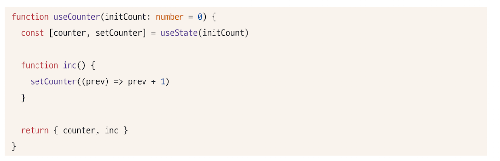

- useState의 등장으로 리액트에서는 여러 컴포넌트에 걸쳐, 손쉽게 동일한 인터페이스의 상태를 생성하고 관리할 수 있게 되었다.
- 이미지와 같이, useCounter라는 훅을 만들어 함수 컴포넌트 어디서든 사용할 수 있게 구현하였다. 이러한 재사용성이 리액트 훅의 장점이다.

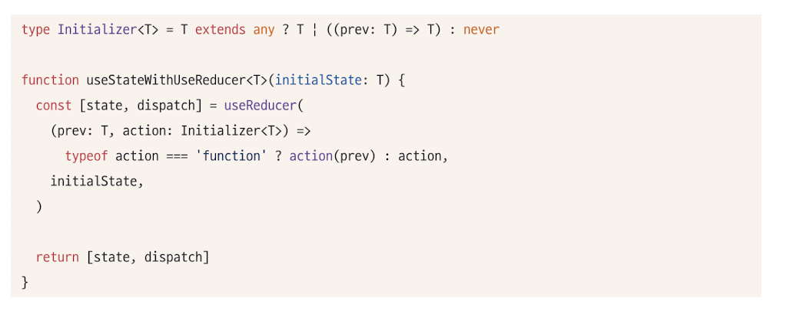

- useState와 비슷한 useReducer 또한 지역상태를 관리할 수 있는 훅이다.
- useState는 useReducer로 구현되어있다.
- 위와 비슷한 코드로 예상된다.
- T를 받거나, (prev:T)=>T를 받아 새로운 값을 설정할 수 있게끔 코드를 작성했다.

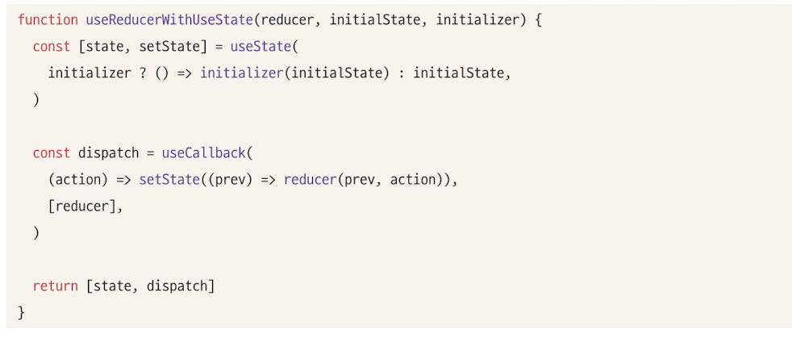

- useReducer또한 useState로 작성할 수 있다.
- 두 훅 모두 지역상태관리를 위해 만들어졌다.

**한계점**

- 훅을 사용할때마다, 컴포넌트별로 초기화되므로, 컴포넌트에 따라 서로다른 상태를 가질 수 밖에 없다. 즉 지역적으로만 유효하다.
- 두개 이상의 컴포넌트가 동일한 상태를 바라보기 위해, 상태를 컴포넌트 밖으로 끌어올리는 방법이 있지만, props형태로 컴포넌트에 제공해야한다.

## 5.2.2 지역 상태의 한계를 벗어나보자: useState의 상태를 바깥으로 분리하기

- useState가 지역적인 컴포넌트의 클로저가 아닌, 다른 자바스크립트 실행문맥에서 초기화되어 관리된다면
- 그 상태를 참조하는 유효한 스코프 내부에서는 해당 객체의 값을 공유하고, 변경할 수 있을 것이다.

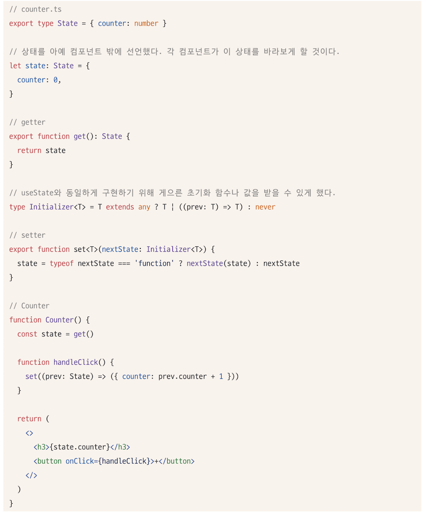

- 하지만, 위 방식은 리액트 환경에서 작동하지 않는다.
- 컴포넌트를 리렌더링하는 장치가 존재하지 않기 때문이다.
- 앞서 2.4절에서 확인했듯, 다음과 같은 작업 중 하나가 일어나야한다.

  - useState, useReducer의 반환값 중 두번째 인수가 호출된다.
  - 부모함수가 리렌더링 되거나, 해당 함수가 다시 실행된다. (하지만 일일히 Counter를 재실행하는것은 매우 비효율적)

- 우리가 시도할 수 있는 것은 useState와 useReducer로 보인다.

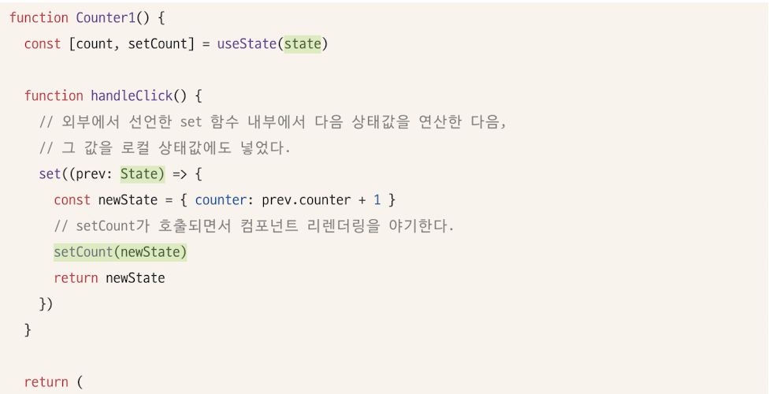
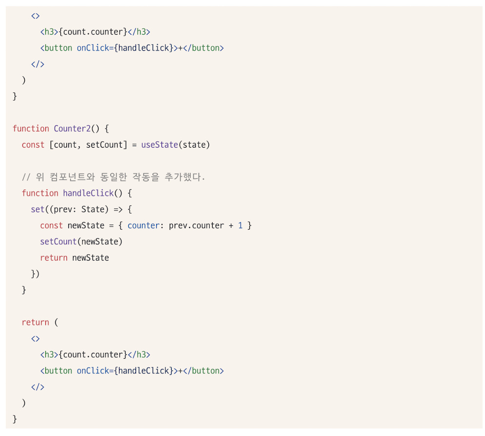

- useState의 인수로 컴포넌트 밖에서 선언한 state를 참조하게 한다.
- handleClick만으로 state를 업데이트하고 있다.
- useState의 두번째 인수로 업데이트 + 외부 선언한 set으로 외부의 상태도 업데이트
- 하지만 비효율적이고 문제가 존재

  - 외부에 상태가 있음에도, 함수컴포넌트의 렌더링을 위해 함수 내부에 동일한 상태를 관리하는 useState가 존재하는 구조이다.
  - 중복해서 관리하므로 비효율적이다.
  - 다른 쪽 컴포넌트에서는 렌더링되지 않는다. (동시 렌더링 불가)

- 즉, 함수 외부에서 상태를 참조하고 렌더링까지 동기화시켜야한다면 필요한 조건은 이와같다.
  - 여러 컴포넌트가 같이쓸 수 있게 외부에 상태를 둬야함
  - 이 외부에 있는 상태를 사용하는 컴포넌트는 , 상태의 변화를 감지해야한다. 변경시키는 컴포넌트 뿐 아니라, 상태를 참조하는 모든 컴포넌트에서 동일해야한다.
  - 상태가 원시값이 아닌, 객체인 경우 그 객체 내에 감지하지 않는 값이 변할 때, 리렌더링이 발생해서는 안된다. 감지하는 값에 대해서만 리렌더링 되어야한다.
- store의 값이 변경됨을 알리는 callback 함수를 실행해야한다. 또한 callback을 등록할 수 있는 subscribe 함수가 필요.

**Store type 선언**
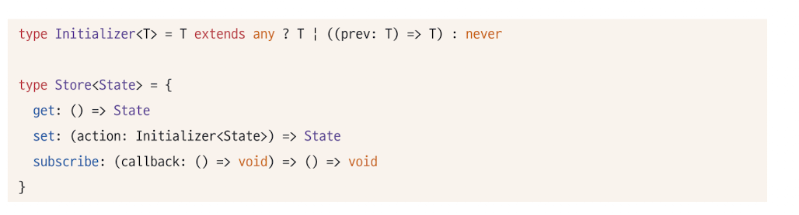

- get은 최신값을 가져오기 위해 함수로 구현.
- set의 형태는 값 또는 함수를 받을 수 있게 만듦
- subscribe는 store의 변경을 감지하고 싶은 컴포넌트들이, 자신의 callback함수를 등록해 두는 곳.
- callback을 인수로 받고, store는 변경될 때마다, 자신에게 등록된 모든 callback을 실행할 것.
- 스토어를 참조하는 컴포넌트는 subscribe에 컴포넌트 자신을 렌더링하는 코드를 추가하여 컴포넌트가 리렌더링을 실행할 수 있게 만들어야함

**Store 함수(createStore) 구현**
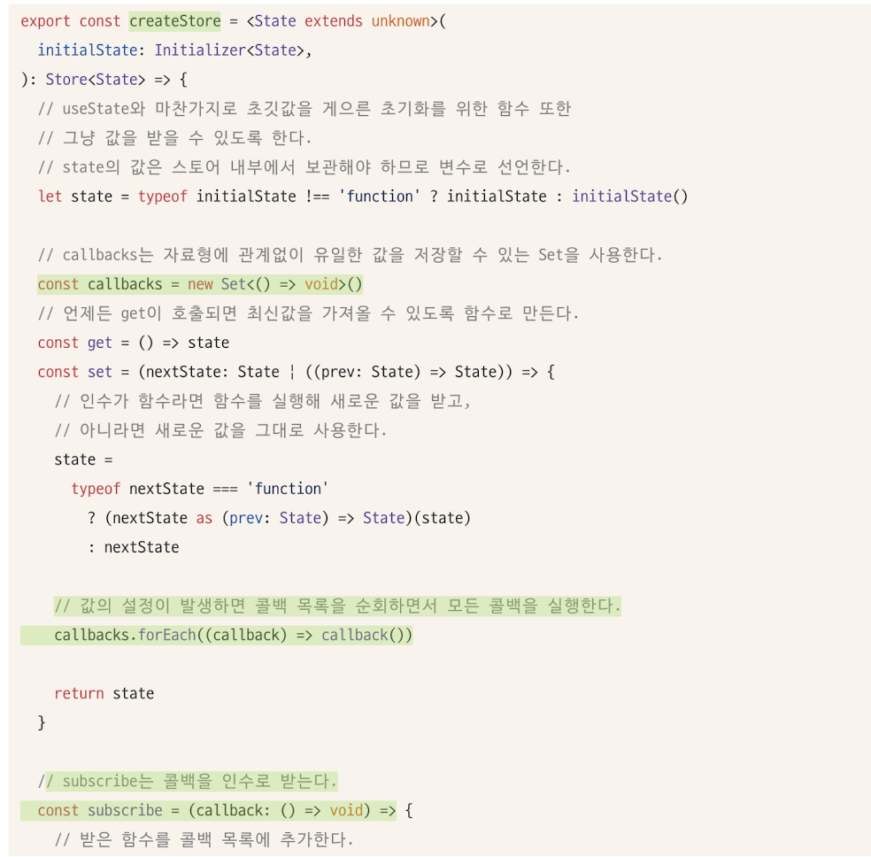
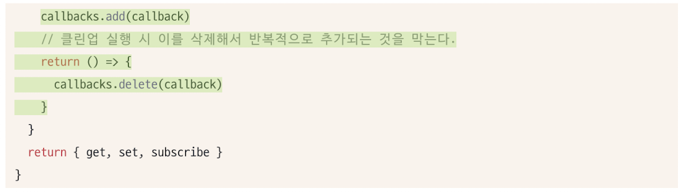

- 구현 설명 : createStore는 자신이 관리해야하는 상태를 내부 변수로 가진 다음, get함수로 해당 변수의 최신값을 제공하며, set 함수로 내부 변수를 최신화하며, 이 과정에서 등록된 콜백을 모조리 실행하는 구조이다.

**store의 변화 감지를 위한 useStore훅 구현**
createStore로 만들어진 store의 값을 참조하고, 이 값의 변화에 따라 컴포넌트 렌더링을 유도할 사용자 정의 훅이 필요하다.
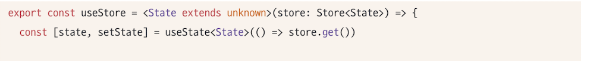
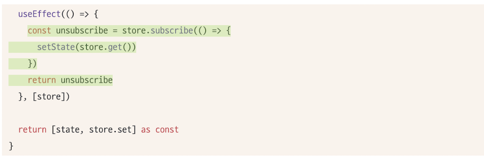

- useState를 활용해 컴포넌트의 렌더링을 유도한다.
- useEffect내부에서 store의 현재 값을 가져와, setState를 수행하는 함수를 store의 subscribe로 등록한다.
- store의 값이 변경될 때마다 subscribe에 등록된 함수를 실행하므로 값의 변경을 보장한다.
- useEffect의 클린업 함수로 unsubscribe를 등록하여 callback에서 해당 함수를 제거한다.

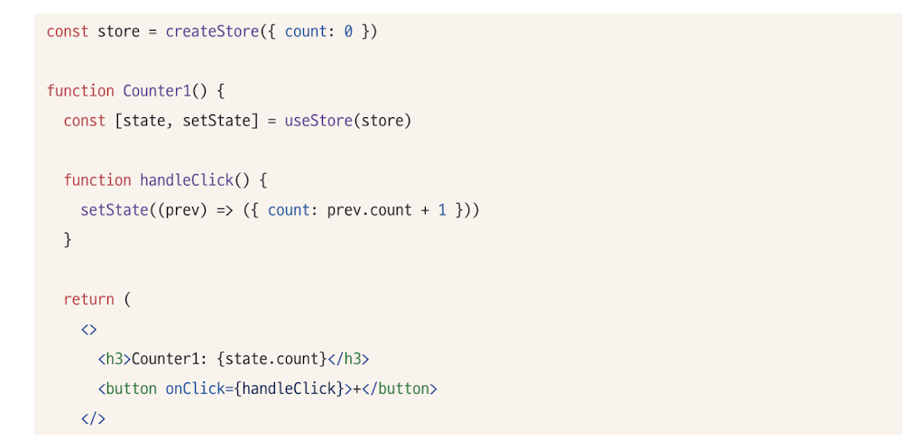
그러나 이 useStore도, 만드는 스토어의 구조가 원시값이라면 상관없으나 객체인 경우 일부값만 subscribe가 불가능하다.
따라서, 변경 감지가 필요한 값만 setState를 호출하여 객체 상태에 대한 불필요한 리렌더링을 막아야한다.

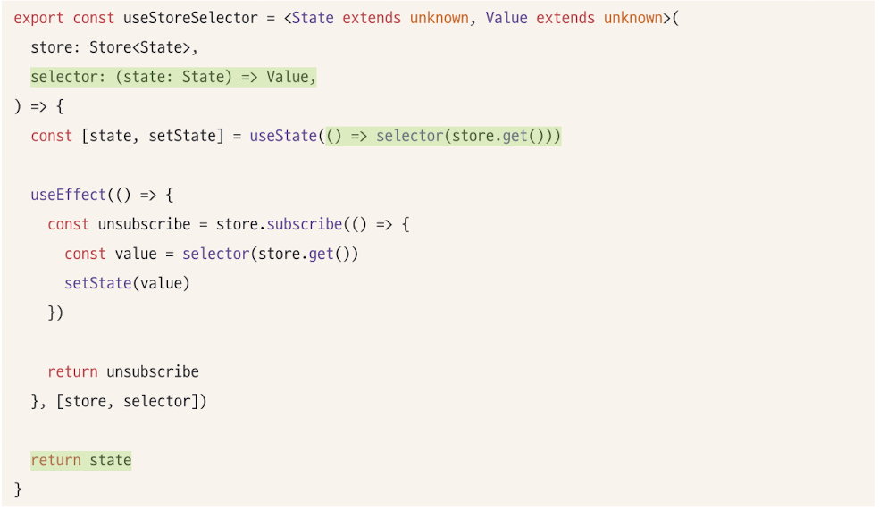

아까와 다르게, 두번째 인수로 selector라는 함수를 받는다.
store의 상태에서 어떤 값을 가져올지 정의하는 함수이다. store의 값이 변경이 되었다고 하더라도, selector(store.get())이 변경되지 않는다면 리렌더링이 일어나지 않는다.

- 사용예시
  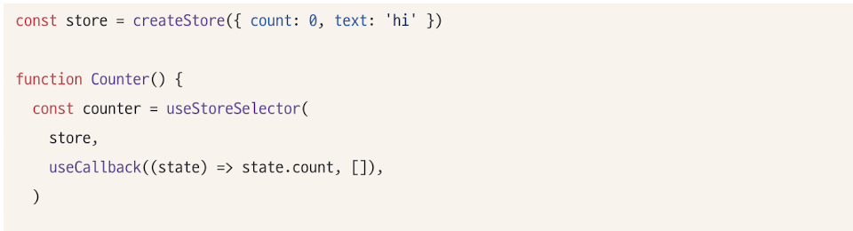

위에서 구현한 훅과 비슷하게, 이미 페이스북 팀에서 만든 useSubscription이라는 훅이 따로 존재한다.
위에 구현된 내용과 차이점은

- selector와 subscribe에 대한 비교가 추가되어, store나 selector의 변경을 무시하고 한정적으로 원하는 값을 반환하게 하여, 안정적으로 상태를 제공하게 한다.
- 리액트 18 에서는 useSubscription 훅이 useSyncExternalStore로 재작성되어있다.

## 5.2.3 useState와 Context를 동시에 사용해보기

### 1. `useState`와 `Context`를 이용한 상태 관리

`useState`와 `useReducer`로 상태를 관리할 때 여러 스코프에서 동일한 구조의 상태를 공유하는 것이 문제가 될 수 있다. 이 문제를 해결하기 위해 **React의 Context**를 활용한다.

- **Context와 Store의 연결**: `createStore`로 스토어를 만들고, 이 스토어를 `CounterStoreContext`에 담아 컴포넌트 트리에 자동으로 전달한다.
- **Provider 컴포넌트**: `CounterStoreProvider`는 스토어를 생성하고 `Context.Provider`의 `value`로 전달한다. `useRef`로 불필요한 리렌더링을 막고 스토어를 최초에 한 번만 생성한다.
- **새로운 훅(Hook) 생성**: Context에서 전달된 스토어에 접근하기 위해 `useContext`를 활용하는 새로운 훅(`useCounterContextSelector`)을 만든다. 이 훅은 `useSubscription`을 사용하여 상태 변경 시에만 컴포넌트가 리렌더링되도록 최적화한다.
- **장점**: Context와 Provider를 활용하면 각 스토어를 분리하여 관리할 수 있어, 어떤 상태가 어떤 스토어에 속하는지 명확하다.

---

## 5.2.4 상태관리 라이브러리 Recoil,Jotai,Zustand 살펴보기

### React 상태 관리 라이브러리 비교: Recoil, Jotai, Zustand

---

#### 1\. Recoil

Recoil은 메타(Meta)에서 개발한 상태 관리 라이브러리로, 리액트의 내장 기능인 Context와 Hooks를 기반으로 한다. 리덕스와 달리 `redux-thunk` 같은 미들웨어 없이도 비동기 처리가 가능하며, 리액트 18의 최신 기능들을 지원한다.

- **핵심 개념**: `RecoilRoot`, `atom`, `selector`를 사용한다.
- **상태 관리**: `atom`은 고유한 `key`와 기본값(`default`)을 가져야 하는 상태의 최소 단위다. 이 `atom`들은 `RecoilRoot`가 만드는 스토어에 저장된다.
- **비동기 처리**: `selector`를 통해 비동기 데이터 처리가 가능하며, `useRecoilStateLoadable`, `waitForAll` 같은 비동기 API를 제공한다.
- **리렌더링 최적화**: `atom` 값이 변경되면 해당 `atom`을 구독하는 컴포넌트만 리렌더링된다.

**코드 예시**: `RecoilRoot`를 최상단에 선언하고, `atom`을 정의한 후 `useRecoilState` 훅으로 상태를 사용한다.

```jsx
const counterState = atom({
  key: "counterState",
  default: 0,
});

function Counter() {
  const [count, setCount] = useRecoilState(counterState);
  return (
    <>
      <div>{count}</div>
      <button onClick={() => setCount((prev) => prev + 1)}>증가</button>
    </>
  );
}

function App() {
  return (
    <RecoilRoot>
      <Counter />
    </RecoilRoot>
  );
}
```

---

#### 2\. Jotai

Jotai는 Recoil의 모델에서 영감을 받았지만, 더 간결하고 가벼운 상태 관리를 목표로 하는 라이브러리다. Recoil과 달리 `atom`에 `key`를 명시적으로 지정할 필요가 없으며, 내부적으로 관리된다.

- **핵심 개념**: `atom`을 사용하지만 `key`가 필수가 아니다. `atom` 자체에 상태를 저장하지 않고, `WeakMap`에 저장된 객체 참조를 통해 관리된다.
- **파생된 상태**: `atom`을 조합하여 파생된 상태를 쉽게 만들 수 있다. `read` 함수만 포함하는 읽기 전용 파생 상태를 만들거나, `read`와 `write` 함수를 모두 포함해 기존 `atom`의 값을 업데이트하는 파생 상태도 만들 수 있다.
- **비동기 처리**: `atom` 내부에 함수를 인수로 넣어 비동기 작업을 처리할 수 있으며, 리액트의 `Suspense`를 지원한다.
- **장점**: Recoil보다 번들 크기가 매우 작고, 복잡한 설정 없이 간단하게 사용할 수 있다.

**코드 예시**: `atom`을 외부에서 선언하고, `useAtom` 훅으로 컴포넌트에서 상태를 사용한다.

```jsx
import { atom, useAtom } from "jotai";

const counterAtom = atom(0);

const isBiggerThan10Atom = atom((get) => get(counterAtom) > 10);

function Counter() {
  const [count, setCount] = useAtom(counterAtom);
  return (
    <>
      <div>{count}</div>
      <h3>{`count is bigger than 10: ${isBiggerThan10}`}</h3>
      <button onClick={() => setCount((prev) => prev + 1)}>Increment</button>
    </>
  );
}
```

---

#### 3\. Zustand

Zustand는 리덕스의 단일 스토어 모델을 따르지만, 복잡한 보일러플레이트 코드를 제거한 라이브러리다. 리액트 컴포넌트 외부에서도 동작하는 바닐라 스토어를 생성할 수 있는 것이 특징이다.

- **핵심 개념**: `create` 함수를 통해 스토어를 정의하고, `useStore` 훅으로 컴포넌트에서 상태를 사용한다.
- **상태 업데이트**: `set` 함수를 사용해 상태를 업데이트하며, `partial`과 `replace` 두 가지 방식을 지원한다. `partial`은 상태의 일부만 업데이트하고, `replace`는 상태를 완전히 새로운 값으로 교체한다.
- **미들웨어 지원**: 리덕스처럼 미들웨어를 지원한다. `persist`, `immer`와 같은 미들웨어를 추가하여 상태 관리를 확장할 수 있다.
- **장점**: 간편한 API와 작은 번들 크기로 빠른 개발이 가능하며, 리액트에 종속되지 않아 활용도가 높다.

**코드 예시**: `create` 함수로 스토어를 정의하고, 컴포넌트에서 `useStore` 훅을 통해 스토어에 접근한다.

```jsx
import create from "zustand";

const useCounterStore = create((set) => ({
  count: 1,
  inc: () => set((state) => ({ count: state.count + 1 })),
  dec: () => set((state) => ({ count: state.count - 1 })),
}));

function Counter() {
  const { count, inc, dec } = useCounterStore();
  return (
    <div>
      <span>{count}</span>
      <button onClick={inc}>up</button>
      <button onClick={dec}>down</button>
    </div>
  );
}
```

---

#### 라이브러리별 차이점 요약

| 특징               | Recoil                                                      | Jotai                                                          | Zustand                                                   |
| :----------------- | :---------------------------------------------------------- | :------------------------------------------------------------- | :-------------------------------------------------------- |
| **상태 관리 방식** | **하향식(Top-Down)** : `RecoilRoot`를 통해 상태를 관리      | **상향식(Bottom-Up)** : 독립적인 `atom`을 조합하여 상태를 관리 | **단일 스토어** : 하나의 스토어에 상태를 집중 관리        |
| **`atom`**         | **고유한 `key` 필수** : `atom`마다 고유한 문자열 `key` 필요 | **고유한 `key` 불필요** : 내부적으로 자동 관리됨               | **`atom` 개념 없음** : `create` 함수로 스토어에 상태 정의 |
| **파생된 상태**    | `selector`를 사용해 파생 상태 생성                          | `atom`을 조합하여 파생 상태 생성                               | `selector`를 사용해 필요한 상태 선택                      |
| **상태 업데이트**  | `setRecoilState`로 상태 업데이트                            | `useAtom`으로 반환된 함수로 업데이트                           | `set` 함수로 `partial` 또는 `replace` 업데이트            |
| **비동기 처리**    | `selector`를 통해 비동기 처리 및 캐싱                       | `atom` 내부에 함수를 인수로 넣어 처리                          | 미들웨어나 리액트 훅을 통해 처리                          |
| **번들 크기**      | 상대적으로 큼                                               | **매우 작음**                                                  | **매우 작음**                                             |
| **미들웨어**       | 미들웨어 지원하지 않음                                      | 미들웨어 지원하지 않음                                         | `persist`, `immer` 등 미들웨어 지원                       |

## 5.2.5 정리

리액트의 상태 관리 방식은 다양하지만, 리액트에서 리렌더링을 유발하는 방식은 공통적이다. 각 라이브러리의 특징을 파악하고 애플리케이션의 상황에 맞는 라이브러리를 선택하는 것이 중요하다.

- 최신 트렌드: 리덕스 외에 Jotai, Recoil, Zustand 등 다양한 라이브러리들이 등장했다.

- 유지보수: NPM 다운로드 순위가 높은 라이브러리는 관리와 유지보수가 잘 되고 있다는 의미이므로, 선택 시 이를 고려하는 것이 좋다.

- 리액트 버전 변화 대응: 리액트 18과 같은 버전 변화에 따라 상태 관리 라이브러리도 꾸준히 대응할 필요가 있다.
