# 5.2 리액트 훅으로 시작하는 상태 관리

- 리액트 생태계에서, 상태관리를 위해 오랜기간 리덕스에 의존했다.
- 현재는 새로운 Context API, useReducer, useState의 등장으로 컴포넌트에 걸쳐서 재사용하거나, 컴포넌트 내부에 걸쳐서 상태를 관리할 수 있게 되었다.
- 리액트 16.8에서 등장한 훅과, 함수 컴포넌트의 패러다임에서 애플리케이션 내부 상태관리는 어떻게 할 수 있고, 새로운 방법을 채택한 라이브러리는 어떤 것이 있고 어떻게 작동하는지 알아보자.

## 5.2.1 가장 기본적인 방법: useState와 useReducer

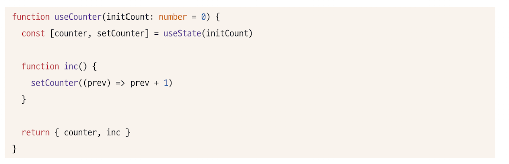

- useState의 등장으로 리액트에서는 여러 컴포넌트에 걸쳐, 손쉽게 동일한 인터페이스의 상태를 생성하고 관리할 수 있게 되었다.
- 이미지와 같이, useCounter라는 훅을 만들어 함수 컴포넌트 어디서든 사용할 수 있게 구현하였다. 이러한 재사용성이 리액트 훅의 장점이다.

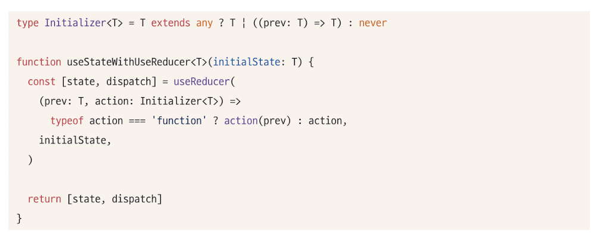

- useState와 비슷한 useReducer 또한 지역상태를 관리할 수 있는 훅이다.
- useState는 useReducer로 구현되어있다.
- 위와 비슷한 코드로 예상된다.
- T를 받거나, (prev:T)=>T를 받아 새로운 값을 설정할 수 있게끔 코드를 작성했다.

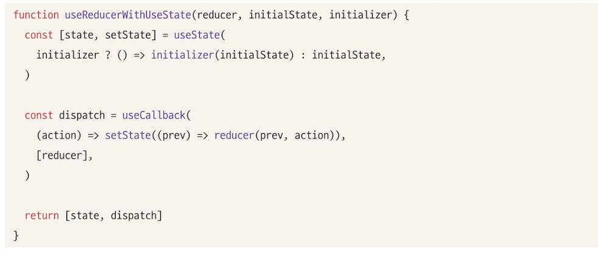

- useReducer또한 useState로 작성할 수 있다.
- 두 훅 모두 지역상태관리를 위해 만들어졌다.

**한계점**

- 훅을 사용할때마다, 컴포넌트별로 초기화되므로, 컴포넌트에 따라 서로다른 상태를 가질 수 밖에 없다. 즉 지역적으로만 유효하다.
- 두개 이상의 컴포넌트가 동일한 상태를 바라보기 위해, 상태를 컴포넌트 밖으로 끌어올리는 방법이 있지만, props형태로 컴포넌트에 제공해야한다.

## 5.2.2 지역 상태의 한계를 벗어나보자: useState의 상태를 바깥으로 분리하기

- useState가 지역적인 컴포넌트의 클로저가 아닌, 다른 자바스크립트 실행문맥에서 초기화되어 관리된다면
- 그 상태를 참조하는 유효한 스코프 내부에서는 해당 객체의 값을 공유하고, 변경할 수 있을 것이다.

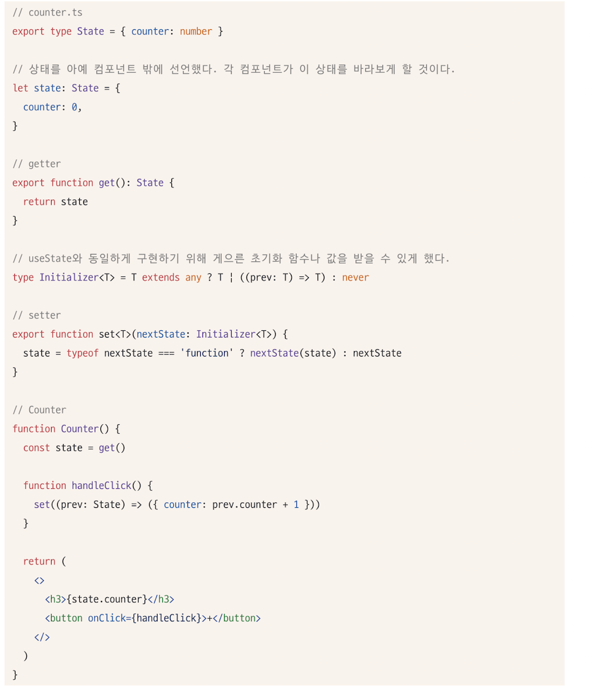

- 하지만, 위 방식은 리액트 환경에서 작동하지 않는다.
- 컴포넌트를 리렌더링하는 장치가 존재하지 않기 때문이다.
- 앞서 2.4절에서 확인했듯, 다음과 같은 작업 중 하나가 일어나야한다.

  - useState, useReducer의 반환값 중 두번째 인수가 호출된다.
  - 부모함수가 리렌더링 되거나, 해당 함수가 다시 실행된다. (하지만 일일히 Counter를 재실행하는것은 매우 비효율적)

- 우리가 시도할 수 있는 것은 useState와 useReducer로 보인다.

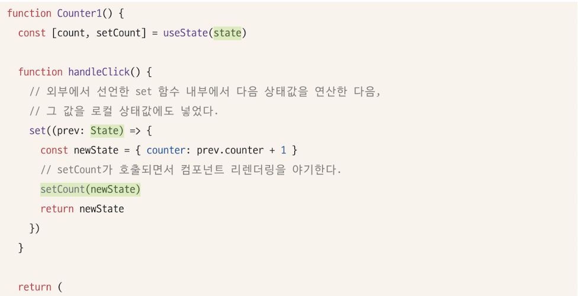
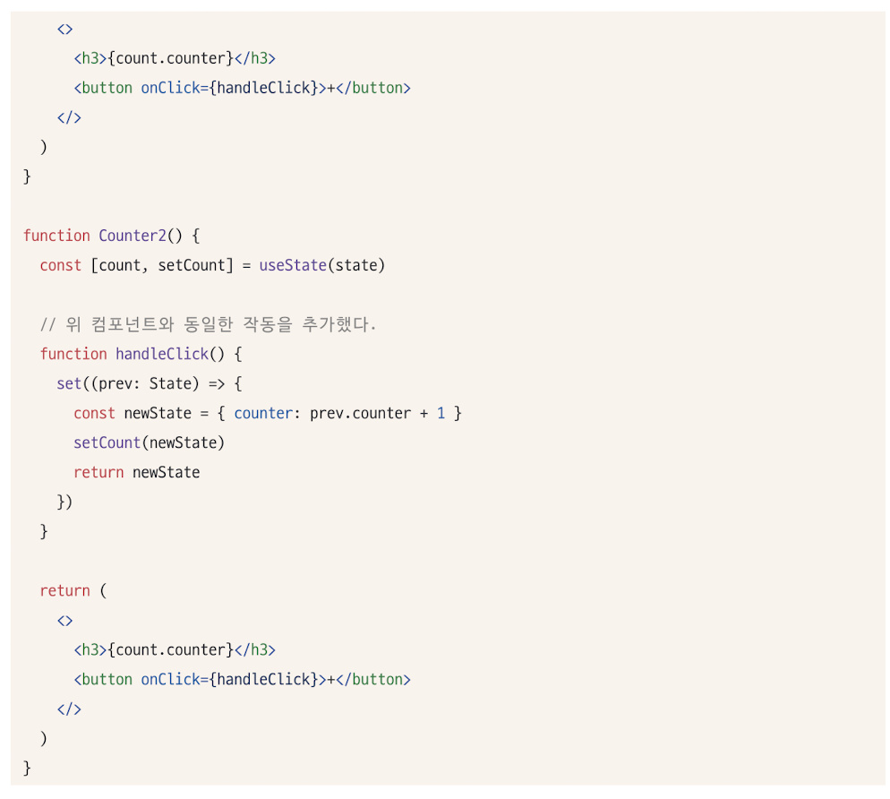

- useState의 인수로 컴포넌트 밖에서 선언한 state를 참조하게 한다.
- handleClick만으로 state를 업데이트하고 있다.
- useState의 두번째 인수로 업데이트 + 외부 선언한 set으로 외부의 상태도 업데이트
- 하지만 비효율적이고 문제가 존재

  - 외부에 상태가 있음에도, 함수컴포넌트의 렌더링을 위해 함수 내부에 동일한 상태를 관리하는 useState가 존재하는 구조이다.
  - 중복해서 관리하므로 비효율적이다.
  - 다른 쪽 컴포넌트에서는 렌더링되지 않는다. (동시 렌더링 불가)

- 즉, 함수 외부에서 상태를 참조하고 렌더링까지 동기화시켜야한다면 필요한 조건은 이와같다.
  - 여러 컴포넌트가 같이쓸 수 있게 외부에 상태를 둬야함
  - 이 외부에 있는 상태를 사용하는 컴포넌트는 , 상태의 변화를 감지해야한다. 변경시키는 컴포넌트 뿐 아니라, 상태를 참조하는 모든 컴포넌트에서 동일해야한다.
  - 상태가 원시값이 아닌, 객체인 경우 그 객체 내에 감지하지 않는 값이 변할 때, 리렌더링이 발생해서는 안된다. 감지하는 값에 대해서만 리렌더링 되어야한다.
- store의 값이 변경됨을 알리는 callback 함수를 실행해야한다. 또한 callback을 등록할 수 있는 subscribe 함수가 필요.

**Store type 선언**
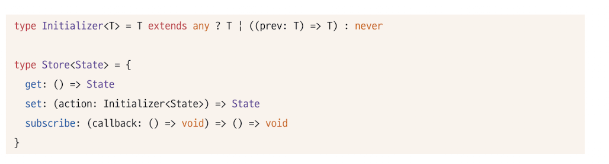

- get은 최신값을 가져오기 위해 함수로 구현.
- set의 형태는 값 또는 함수를 받을 수 있게 만듦
- subscribe는 store의 변경을 감지하고 싶은 컴포넌트들이, 자신의 callback함수를 등록해 두는 곳.
- callback을 인수로 받고, store는 변경될 때마다, 자신에게 등록된 모든 callback을 실행할 것.
- 스토어를 참조하는 컴포넌트는 subscribe에 컴포넌트 자신을 렌더링하는 코드를 추가하여 컴포넌트가 리렌더링을 실행할 수 있게 만들어야함

**Store 함수(createStore) 구현**
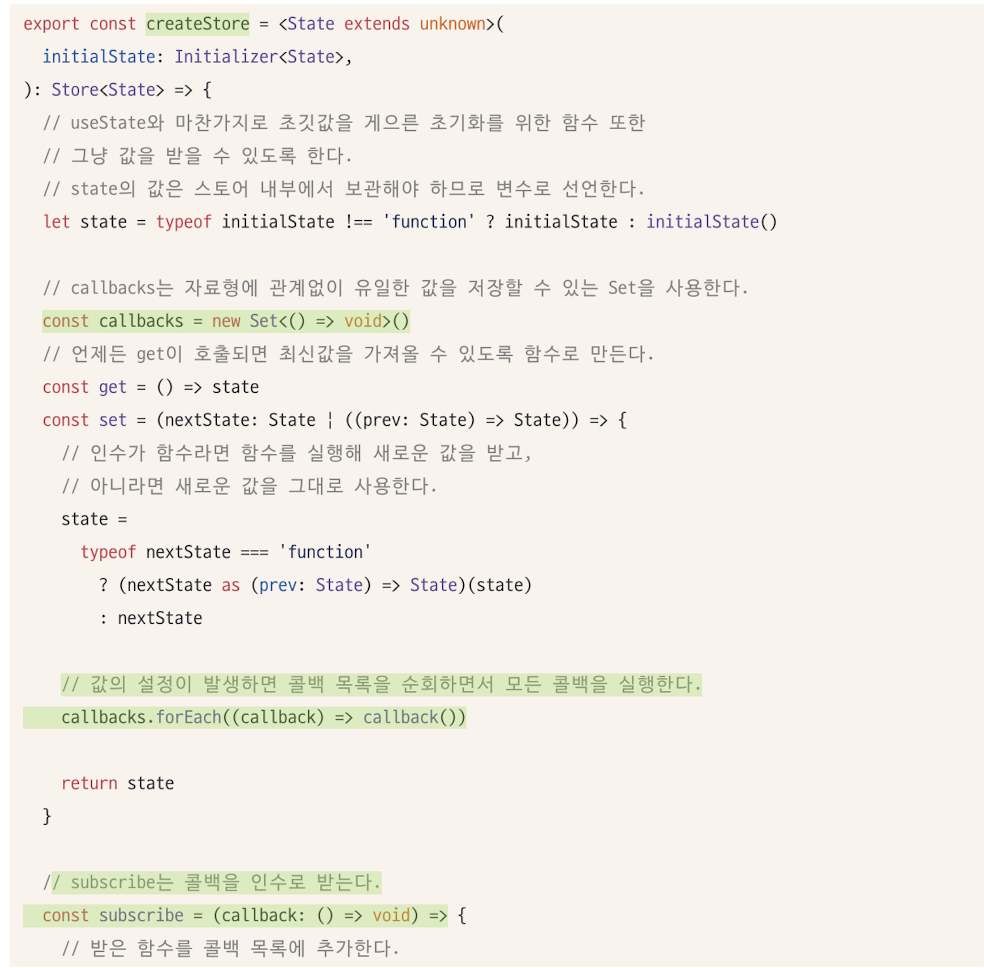
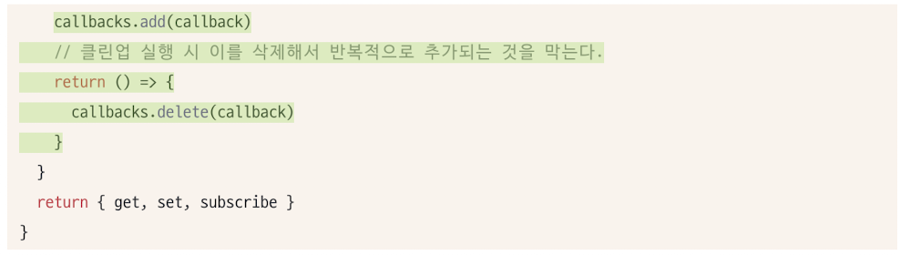

- 구현 설명 : createStore는 자신이 관리해야하는 상태를 내부 변수로 가진 다음, get함수로 해당 변수의 최신값을 제공하며, set 함수로 내부 변수를 최신화하며, 이 과정에서 등록된 콜백을 모조리 실행하는 구조이다.

**store의 변화 감지를 위한 useStore훅 구현**
createStore로 만들어진 store의 값을 참조하고, 이 값의 변화에 따라 컴포넌트 렌더링을 유도할 사용자 정의 훅이 필요하다.
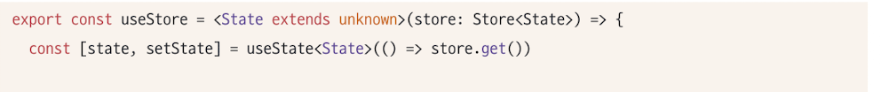
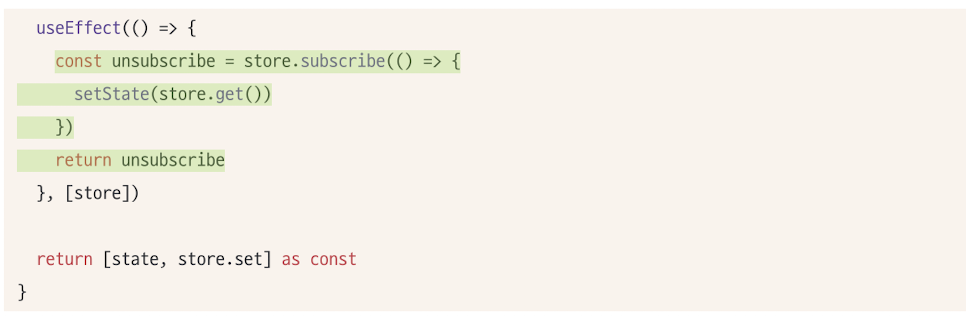

- useState를 활용해 컴포넌트의 렌더링을 유도한다.
- useEffect내부에서 store의 현재 값을 가져와, setState를 수행하는 함수를 store의 subscribe로 등록한다.
- store의 값이 변경될 때마다 subscribe에 등록된 함수를 실행하므로 값의 변경을 보장한다.
- useEffect의 클린업 함수로 unsubscribe를 등록하여 callback에서 해당 함수를 제거한다.

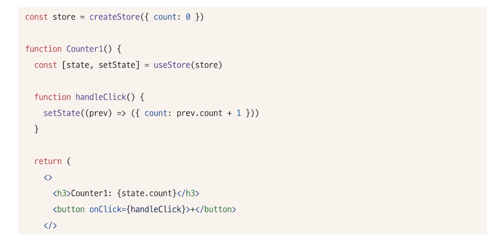
