# 6.3 리액트 개발 도구 활용하기

- 리액트 개발 도구가 정상적으로 설치됐고, 디버깅할 수 있는 페이지에 접근했다면 크롬 개발자 도구에 두 가지 메뉴가 추가된다.
  - **Components**
  - **Profiler**

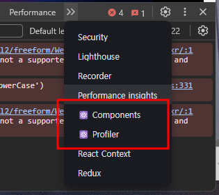
- 리액트 개발자 도구에서 제공하는 디버그 도구
- 리액트 애플리케이션에서 일어나는 대부분의 작동을 확인할 수 있음.

## 6.3.1 컴포넌트

### Components 탭

- 리액트 애플리케이션의 **컴포년트 트리를 확인**할 수 있다.
  (단순히 컴포년트의 구조뿐만 아니라 props와 내부 hooks 등 다양한 정보를 확인 가능)

#### 🎄 컴포넌트 트리
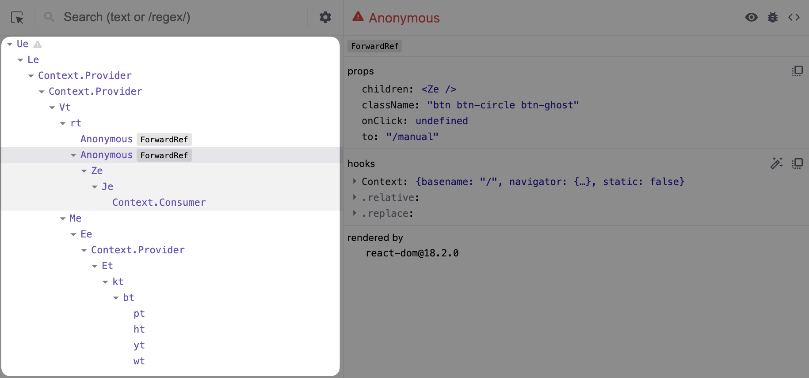
- 리액트 애플리케이션 전체의 트리 구조를 보여준다.
- 기명 함수로 선언되어 컴포넌트명을 알 수 있다면 해당 컴포넌트명을 보여준다.
- 익명 함수로 선언돼 있다면 `Anonymous`라는 이름으로 컴포넌트를 보여준다.
  - 대표적인 예: `memo`, `forwardRef`, 고차 컴포넌트(HOC) 등

**16.9 버전 이후 :** 이러한 문제가 일부 해결.

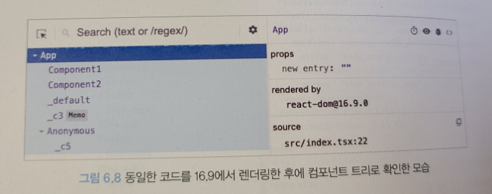

- 명칭을 추론할 수 없는 Anonymous가 \_c3, \_c5등으로 개선
  그러나, 컴포넌트를 특정하기 어려움

#### 익명함수 'Anonymous' 해결 방법
1. `기명함수`를 선언하여 해결하기 


```js
const MemoizedComponent = memo(function MemoizedComponent() {
  return <>MemoizedComponent</>;
});

const withSampleHOC = (Component: ComponentType) => {
  return function withsampleHOC() {
    return <Component />;
  };
};
const HOCComponent = withsampleHOC(function HOCComponent() {
  return <>HOCComponent</>;
});
```

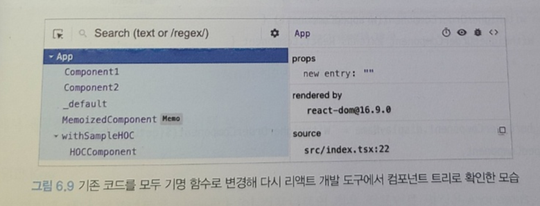

2. `displayName` 속성 추가하여 해결하기

```js
const MemoizedComponent = memo(function () {
  return <>MemoizedComponent</>;
});

MemoizedComponent.displayName = '메모 컴포넌트입니다.';
```
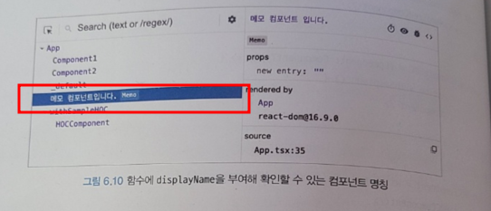

> #### ⁉️ 컴포넌트명 확인은 개발도구에서만
>
> 1. 리액트를 빌드한 트리인 경우, 기명 함수로 선언해도 terser등의 압축 도구들이 **컴포넌트 명을 단순하게 난수화 하기 때문에 확인이 어려워짐**.
> 2. Component.displayName의 경우에도 빌드 도구가 사용하지 않는 코드로 인식해 **삭제할 가능성**이 있음 ➡️ **displayName과 함수명은 개발도구에서만 제한적 참고 권장**

#### 컴포넌트명과 props
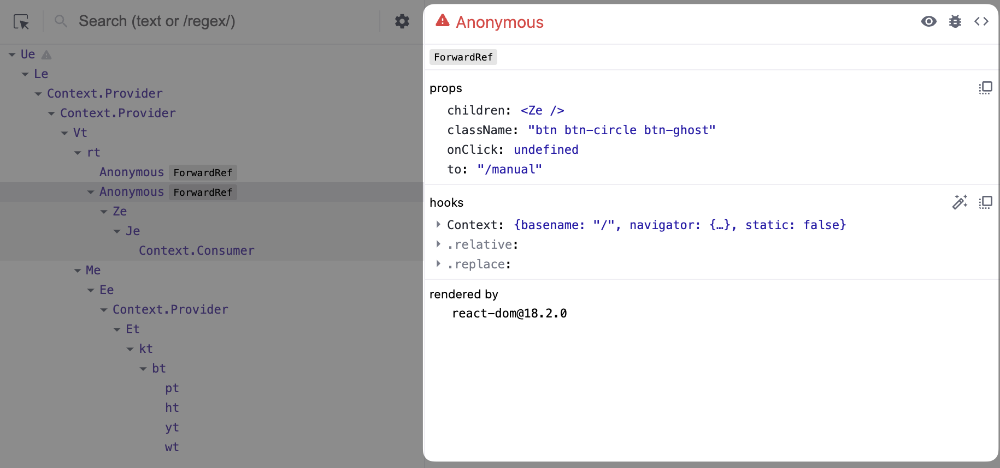

- 컴포넌트 트리에서 컴포넌트를 선택했을 때 해당 컴포넌트에 대한 자세한 정보를 보여주는 영역

#### 컴포넌트명과 Key

- 컴포넌트의 명칭과 해당 컴포넌트를 나타낸다.
- 빨간색 경고: `strict mode`로 렌더링되지 않았다는 것을 의미

#### 컴포넌트 도구
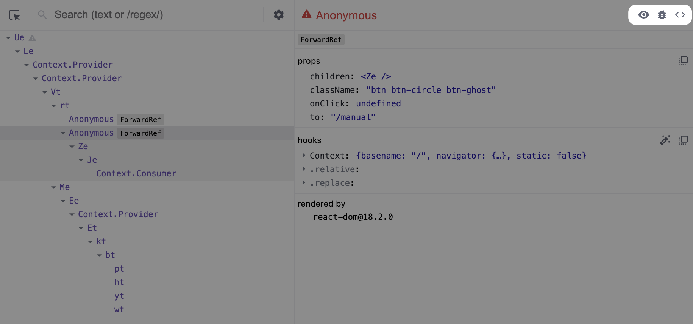
1. **눈 아이콘:** 요소(Elements) 탭으로 즉시 이동하며, 해당 컴포넌트가 렌더링한 HTML 요소가 선택된다.
2. **벌레 아이콘:** 콘솔(Console) 탭에 해당 컴포넌트의 정보가 `console.log`를 실행해 기록된다.
   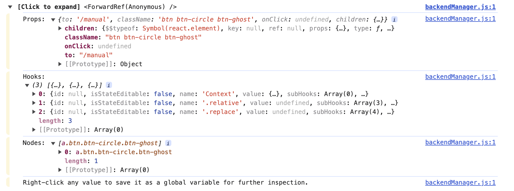
3. **소스코드 아이콘:** 해당 컴포넌트의 소스코드를 확인할 수 있다.
   - 프로덕션 모드에서는 소스코드가 최대로 압축돼 있어 읽기가 어렵다. (난독화)
   - 소스(Sources) 탭 좌측 하단의 **`{}`** 아이콘을 통해 코드를 정리해 볼 수 있다.

#### 컴포넌트 props

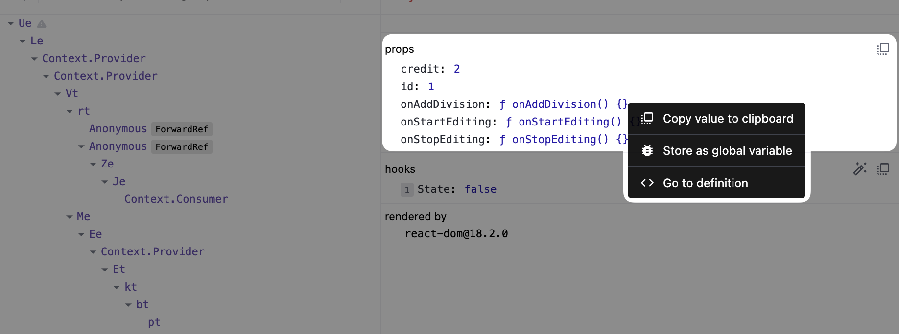

- 컴포넌트가 받은 props를 확인할 수 있다.
- 마우스 우클릭을 하면 해당 props 정보를 복사하는 버튼이 나온다.
  - **Copy value to clipboard:** 클립보드로 복사된다.
  - **Store as global variable:** `window.$r`에 정보가 담긴다.
    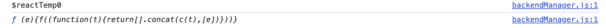
  - **Go to definition:** 값이 함수인 props를 눌렀을 때만 나타나며, 해당 함수가 선언된 코드로 이동한다.

#### 컴포넌트 hooks

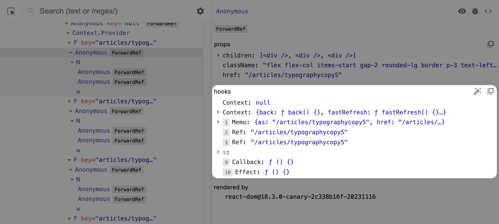

- 컴포넌트에서 사용 중인 훅 정보를 확인할 수 있다.
- `use`가 생략된 이름으로 나타난다. (`useState` → `State`)
- 훅에 넘겨주는 함수를 익명 함수 대신 기명 함수로 넘겨주면 해당 훅을 실행할 때 실행되는 함수의 이름을 확인할 수 있다.

```jsx
// before
useEffect(() => {
  console.log('useEffect');
});

// after
useEffect(function effectonlyMount() {
  console.log('useEffect');
});
```
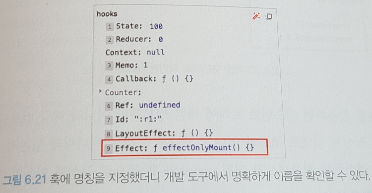

#### 컴포넌트를 렌더링한 주체, rendered by

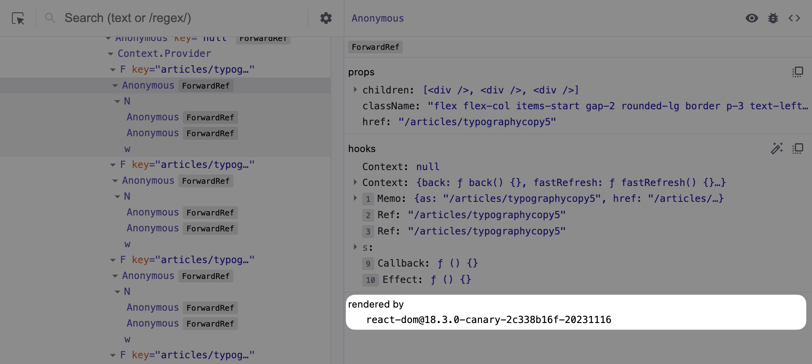

- 해당 컴포넌트를 렌더링한 주체가 누구인지 확인할 수 있다.
- 프로덕션 모드에서는 `react-dom`의 버전만 확인할 수 있다.
- 개발 모드에서는 해당 컴포넌트를 렌더링한 부모 컴포넌트까지 확인할 수 있다.

## 6.3.2 프로파일러

### 🔯 Profiler 탭

- 리액트가 렌더링하는 과정에서 발생하는 상황을 확인하기 위한 도구
  - 어떤 컴포넌트가 렌더링됐는지
  - 몇 차례 렌더링이 발생했는지
  - 어떤 작업에서 오래 걸렸는지 등
- 프로덕션 빌드에서는 사용할 수 없다.  
  → 렌더링 과정에 개입해 디버깅에 필요한 내용을 기록해야 하기 때문

#### 프로파일링 메뉴
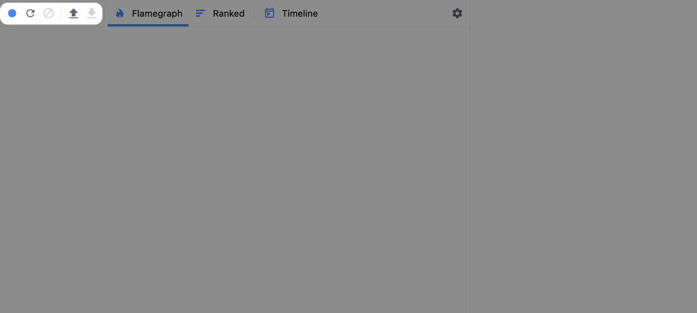
1. Start Profiling: 프로파일링 시작, 누르면 적색 동그라미로 바뀌며 다시 누르면 프로파일링이 중단되고 결과가 나타난다.
2. Reload and Start profiling: 웹페이지가 새로고침됨과 동시에 프로파일링이 시작된다. 그 외는 Start Profiling과 동일하다.
3. Stop Profiling: 프로파일링된 현재 내용을 모두 지우는 버튼
4. Load Profile: 프로파일링 결과(JSON) 불러오기
5. Save Profile: 프로파일링 결과(JSON) 저장하기

#### 중요한 설정

| 이미지                                        | 설정                                                             | 설명                                                                                                                                  |
| --------------------------------------------- | ---------------------------------------------------------------- | ------------------------------------------------------------------------------------------------------------------------------------- |
| 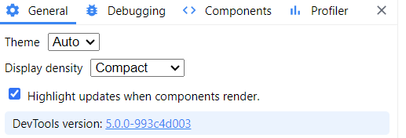 | General탭 - Highlight updates when components render             | 컴포넌트가 렌더링 될 때마다 해당 컴포넌트에 하이라이트를 표시, 매우 유용한 기능이므로 꼭 켜두는 것을 권장                             |
| 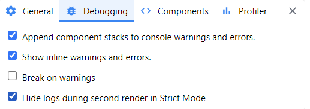 | Debugging 탭 - Hide logs during second render in Strict Mode     | 리액트 애플리케이션이 엄격 모드에서 실행되는 경우, 원활한 디버깅을 위해 `useEffect` 등이 두번씩 작동하는 의도적인 작동을 막을 수 있음 |
| 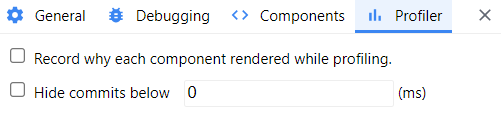 | Profiler 탭 - Record why each component rendered while profiling | 프로파일링 도중 무엇 때문에 컴포넌트가 렌더링 됐는지 기록, 속도가 느려질 수는 있지만 디버깅에 도움이 되는 옵션으로 켜두는 것을 권장   |

#### Flamegraph

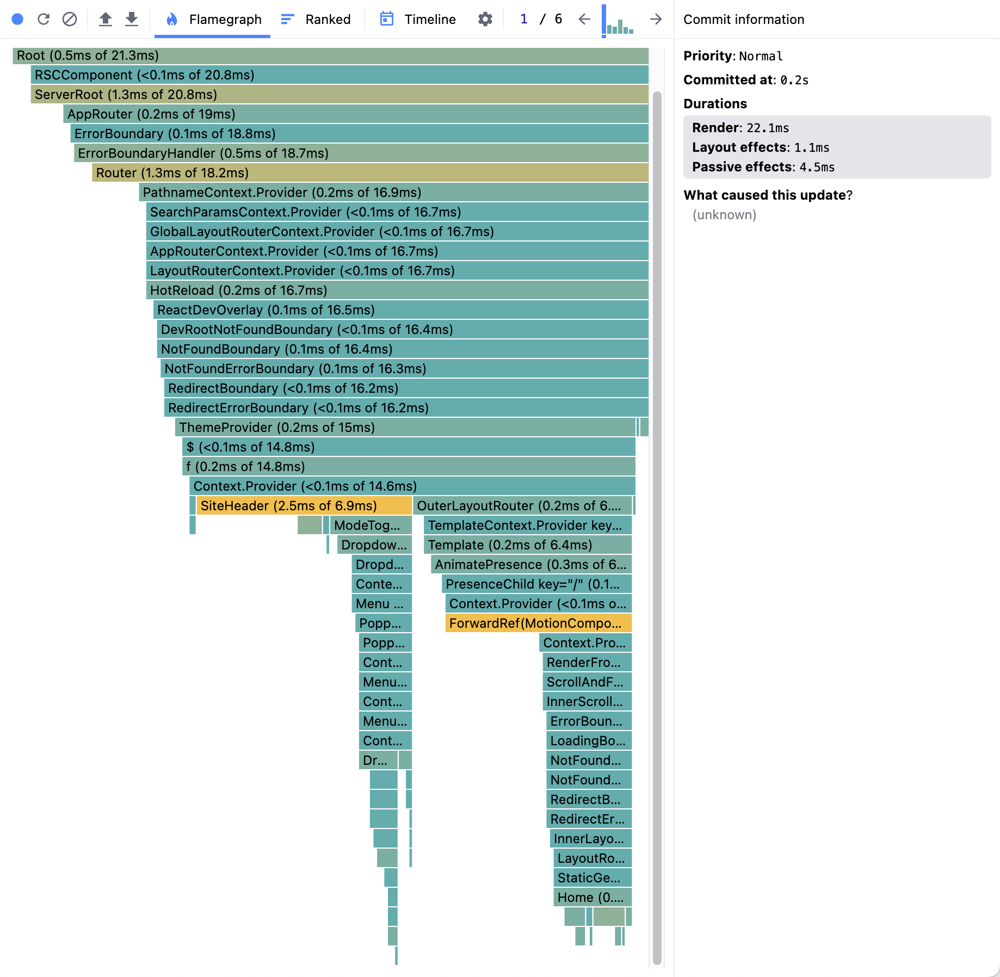

- 렌더 커밋별로 어떠한 작업이 일어났는지 나타낸다.
- 너비가 넓을수록 렌더링하는 데 오래 걸렸다는 것을 의미
- 렌더링되지 않은 컴포넌트도 확인할 수 있다.
  - 메모이제이션이 작동하고 있는지
  - 렌더링이 특정 상태 변화에 따라 제한적으로 발생하고 있는지
- 세로 막대 그래프를 통해 렌더 커밋별로 리액트 트리에서 발생한 렌더링 정보와 횟수를 확인할 수 있다.

> ## Quiz
> 
> ### 문제: 다음 중 React Profiler의 Flamegraph 기능에 대한 설명으로 옳지 않은 것은 무엇일까요?
> 
> 1. 렌더 커밋마다 어떤 컴포넌트가 렌더링되었는지 확인할 수 있다.  
> 2. 메모이제이션 여부나 상태 변화에 따른 렌더링 최적화 여부를 파악할 수 있다.  
> 3. 그래프의 너비는 해당 컴포넌트의 파일 크기를 나타낸다.  
> 4. 렌더링되지 않은 컴포넌트도 분석할 수 있다.  
> 
> <details>
> <summary>정답 및 해설</summary>
> 
> **정답: 3**
> 
> **해설:**  
> React Profiler의 세로 막대 그래프에서 **막대의 너비는 해당 렌더링에 소요된 시간**을 의미합니다.  
> 파일 크기와는 관련이 없습니다.  
> 나머지 선택지는 모두 Profiler의 실제 기능입니다.
> 
> </details>

#### Ranked

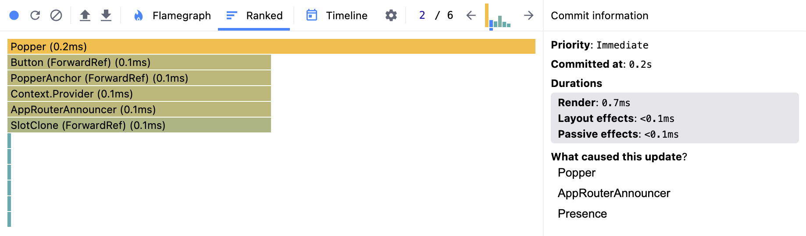

- 해당 커밋에서 렌더링하는 데 시간이 오래 걸린 컴포넌트를 순서대로 나열한 그래프
- 렌더링이 발생한 컴포넌트만 보여주기 때문에 좀 더 간결하게 원하는 정보를 파악할 수 있다.

### Timeline

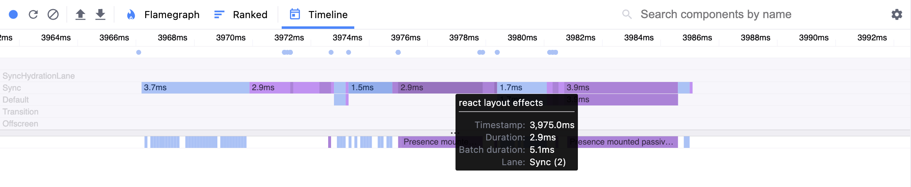

- 시간이 지남에 따라 컴포넌트에서 어떤 일이 일어났는지 확인할 수 있다.
- 리액트 18 이상의 환경에서만 사용할 수 있다.
