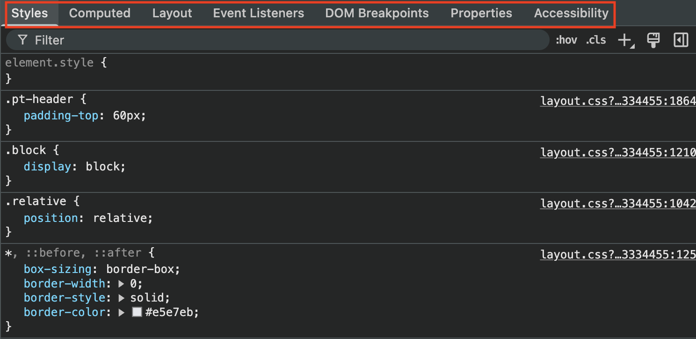

# 7.2 요소 탭
- 개발자 도구에서 첫번째로 노출되어있는 탭. 웹페이지를 구성하는 HTML, CSS 등의 정보를 확인할 수 있다.

## 7.2.1 요소화면

## 7.2.2 요소정보
-   스타일(Styles): 요소와 관련된 스타일 정보를 나타낸다.
-   계산됨(Computed): 해당 요소의 크기, 패딩, 보더, 마진과 각종 CSS 적용 결괏 값을 알 수 있는 탭이다.
-   레이아웃(Layout): CSS 그리드나 레이아웃과 관련된 정보 확인
-   이벤트 리스너(Event Listeners): 현재 요소에 부착된 각종 이벤트 리스너를 확인
-   DOM 중단점: 중단점이 있는지 알려주는 탭
-   속성(Properties): 해당 요소가 가지고 있는 모든 속성값을 나타낸다. 해당 요소가 가지고 있는 모든 값이 나옴(**.attributes**는 직접 할당된 값만 나옴)
-   접근성(Accessibility): 웹 이용에 어려움을 겪는 장애인, 노약자를 위한 스크린리더기 등이 활용하는 값을 말

