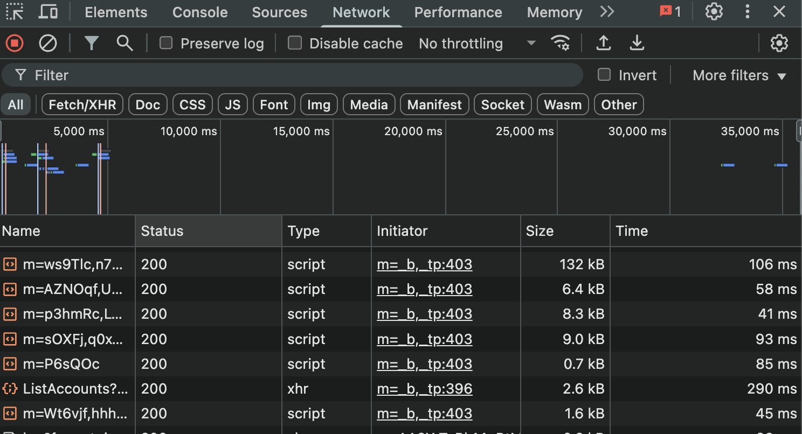

# 7.4 네트워크 탭

- 웹페이지 접속부터 발생하는 모든 네트워크 관련 작동이 기록됨
- All, Fetch, Doc, CSS, JS ... 탭으로 보고 싶은 네트워크 요청 필터링 가능
- 설정의 스크린 샷기능을 켜면, 네트워크 요청 흐름에 따른 스크린샷도 확인이 가능하다.

## 네트워크 탭 활용법 
-   불필요한 요청 또는 중복되는 요청이 없는지
-   웹페이지 구성에 필요한 리소스 크기가 너무 크지 않은지
-   리소스를 불러오는 속도는 적절한지 또는 너무 속도가 오래 걸리는 리소스는 없는지
-   리소스가 올바른 우선순위로 다운로드되어 페이지를 자연스럽게 만들어가는지

