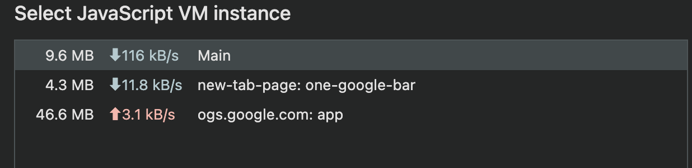

# 7.5 메모리 탭

현재 웹페이지가 차지하고 있는 메모리 관련 정보를 확인할 수 있다.

-   힙 스냅샷: 현재 메모리 상황을 사진 찍듯이 촬영한다.
-   타임라인 할당 계측: 현재 시점의 메모리 상황이 아닌, 시간의 흐름에 따라 메모리의 변화를 살펴볼 수 있다.
-   할당 샘플링: 메모리 공간을 차지하고 있는 자바스크립트 함수

## 7.5.1 자바스크립트 인스턴스 VM 선택

자바스크립트 인스턴스 선택에서 현재 **실행중인 자바스크립트 VM 인스턴스**를 확인하고, 크기만큼 사용자의 브라우저에 부담을 준다.

> 빨간 화살표가 자주 찍힌다 → 메모리를 오래 붙잡고 있는 객체가 많음 → 메모리 누수 가능성
>
> 파란 화살표만 주기적으로 찍힌다 → 대부분의 객체가 짧게 살고 정상적으로 수거됨

### 7.5.2 힙스냅샷

현재 메모리 상태를 확인해 볼 수 있다. 촬영하는 시점의 메모리 현황을 보여준다.

- 메모리 누수 정보를 확인하기 위해서 메모리 누수가 발생할 것으로 예상되는 스크립트 전후로 스냅샷을 찍어서 내용을 비교
- 기명함수를 사용해 내용에서 원하는 함수를 빠르게 찾을 수 있게 해라

> #### 얕은 크기(Shallow Size)와 유지된 크기(Retained Size)의 차이점은 무엇인가요?
>
>메모리 누수를 찾을 때는 얕은 크기(객체 자체의 크기)는 작으나 유지된 크기(객체가 참조하고 있는 모든 객체들의 크기)가 큰 객체를 찾아야 한다.
>
>두 크기의 차이가 큰 객체는 다수의 다른 객체를 참조하고 있다는 뜻, 이는 해당 객체가 복잡한 참조 관계를 가지고 있다는 뜻이다.
>
>이러한 객체가 오랜 시간 메모리에 남아있다면 그로 인해 많은 메모리를 점유하고 있을 수 있다.

### 7.5.3 타임라인 할당 계측

시간의 흐름에 따라 메모리의 변화를 확인할 수 있는 기능

- 변화를 일으킨 변수와 차지하는 크기 확인
- 시간의 흐름에 따른 메모리 변화를 모두 기록해 부담이 있다.

### 7.5.4 할당 샘플링

할당 계측과 유사하게 시간 흐름에 따라 발생하는 메모리 점유를 확인한다.

- 자바스크립트 실행 스택별 분석
  - 함수단위로 분석
- 할당 계측과 유사하지만 브라우저에 주는 부담이 적어 장시간 디버깅에 유리
- 메모리 누수가 짐작되지만, 힙 스냅샷으로는 비교가 어려운 경우 사용
